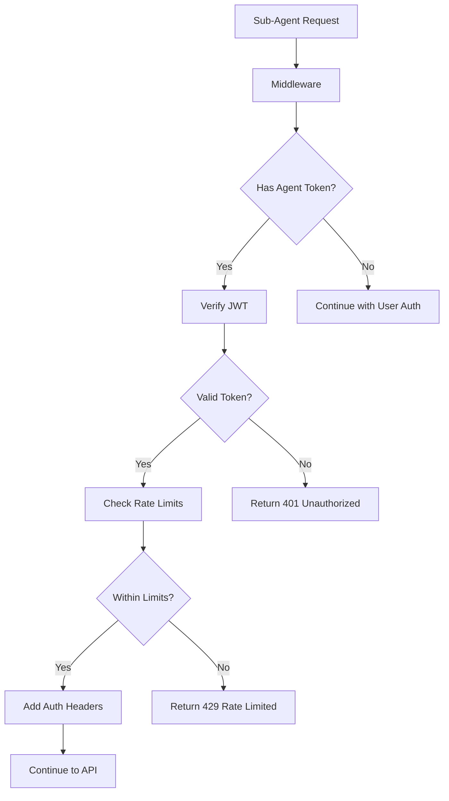

# 🔒 Secure Agent Authentication System

## Overview

This document outlines the comprehensive security solution implemented for sub-agent apps to securely communicate with the main app. The system replaces simple agent keys with a robust JWT-based authentication system with rate limiting, audit trails, and proper permissions.

## 🚀 Key Features

### 1. **JWT-Based Authentication**
- **Secure Tokens**: Custom JWT implementation using HMAC-SHA256 signatures
- **Token Expiration**: 7-day expiry with automatic refresh warnings
- **Audience Validation**: Tokens are scoped to 'sub-agent' audience
- **Issuer Verification**: Only tokens from 'rewrite-complete-main-app' are accepted

### 2. **Rate Limiting**
- **Per-Agent Limits**: 100 requests per minute per agent
- **Sliding Window**: 60-second reset periods
- **Graceful Degradation**: Clear error messages with retry information
- **Headers**: Rate limit status included in response headers

### 3. **Comprehensive Audit Logging**
- **Request Tracking**: All agent requests logged with timestamps
- **IP Address Capture**: Client IP tracking for security monitoring
- **Success/Failure Tracking**: Detailed error logging for failed requests
- **Metadata Collection**: Additional context for security analysis

### 4. **Permission-Based Access Control**
- **Granular Permissions**: 'read', 'execute', 'admin' permission levels
- **Endpoint Protection**: Different endpoints require different permissions
- **Scope Validation**: Tokens contain specific permission scopes

### 5. **Middleware Integration**
- **Automatic Detection**: Middleware automatically detects agent requests
- **Header Injection**: Auth headers added to requests for downstream handlers
- **Transparent Operation**: Works alongside existing user authentication

## 🏗️ Architecture

### Core Components

1. **`src/lib/agent-auth.ts`** - Core authentication logic
2. **`src/lib/auth-helpers.ts`** - Helper functions for API endpoints
3. **`src/middleware.ts`** - Request interception and validation
4. **Updated API endpoints** - Support both user and agent authentication

### Authentication Flow



## 🔧 Implementation Details

### Token Generation (Deployment)

When deploying a sub-agent, the system:

1. **Generates Secure Agent Key**: 32-byte cryptographically secure random key
2. **Creates JWT Token**: Signed token with agent metadata and permissions
3. **Sets Environment Variables**: Both key and token stored in deployment

```typescript
// Generated during deployment
const agentKey = generateSecureAgentKey(); // 32-byte base64url
const agentToken = await generateAgentToken(
  documentId,
  agentKey, 
  deploymentUrl,
  ['read', 'execute']
);
```

### Token Verification (Runtime)

The middleware validates every request:

```typescript
// Middleware validation
const token = extractAgentToken(request);
const authResult = await verifyAgentToken(token);
const rateLimit = checkRateLimit(authResult.payload.agentKey);
```

### API Authentication

Endpoints now support dual authentication:

```typescript
// API endpoint authentication
const authResult = await checkAuthentication(request);
if (authResult.userType === 'agent') {
  // Agent request - permissions already validated
  const { documentId, agentKey, permissions } = authResult.agent;
} else {
  // User request - session-based auth
  const { userId } = authResult;
}
```

## 🛡️ Security Features

### 1. **Token Security**
- **HMAC-SHA256 Signatures**: Cryptographically secure token signing
- **Base64URL Encoding**: Safe URL encoding for all token components
- **Secret Management**: JWT secrets separate from application secrets
- **Expiration Enforcement**: Strict token expiry validation

### 2. **Rate Limiting**
- **In-Memory Store**: Fast rate limit checking (Redis recommended for production)
- **Per-Agent Tracking**: Individual limits per agent key
- **Sliding Windows**: Smooth rate limiting without burst penalties
- **Header Communication**: Clear rate limit status in responses

### 3. **Request Validation**
- **Origin Checking**: Deployment URL validation against whitelist
- **Signature Verification**: Every token signature validated
- **Audience Validation**: Tokens must be intended for sub-agents
- **Expiry Checking**: Expired tokens rejected immediately

### 4. **Audit Trail**
- **Comprehensive Logging**: All requests logged with metadata
- **Security Events**: Failed auth attempts tracked
- **Performance Metrics**: Request timing and success rates
- **IP Tracking**: Client IP addresses for security analysis

## 📊 Monitoring & Headers

### Response Headers

Every agent request includes security headers:

```http
X-RateLimit-Limit: 100
X-RateLimit-Remaining: 95
X-RateLimit-Reset: 1640995200
X-Agent-Auth: verified
X-Agent-Token-Refresh-Needed: true
```

### Audit Logs

All agent requests generate structured logs:

```json
{
  "timestamp": "2024-01-15T10:30:00.000Z",
  "agentKey": "abc123...",
  "endpoint": "/api/agent-credentials-public",
  "method": "GET",
  "success": true,
  "metadata": {
    "ip": "192.168.1.100",
    "needsRefresh": false
  }
}
```

## 🔄 Migration Guide

### From Simple Agent Keys

The new system is backward compatible during transition:

1. **Old requests** (with `agentKey` params) continue working
2. **New requests** (with JWT tokens) use enhanced security
3. **Gradual rollout** as agents are redeployed with new tokens

### For Existing Sub-Agents

1. **Redeploy agents** with updated templates
2. **New environment variables** automatically set:
   - `NEXT_PUBLIC_AGENT_TOKEN` - JWT token for authentication
   - `AGENT_JWT_SECRET` - Secret for token verification

3. **Updated API calls** now use `Authorization: Bearer <token>` headers

## 🚨 Security Considerations

### Production Recommendations

1. **Redis Rate Limiting**: Replace in-memory store with Redis for distributed rate limiting
2. **Log Aggregation**: Send audit logs to centralized logging service
3. **Token Rotation**: Implement periodic token refresh mechanism  
4. **IP Allowlisting**: Consider additional IP-based restrictions
5. **Monitoring**: Set up alerts for high failure rates or rate limit breaches

### Threat Mitigation

- **Token Theft**: Short expiry times limit exposure window
- **Replay Attacks**: Unique tokens per deployment prevent cross-agent attacks
- **Rate Limiting**: Prevents denial-of-service attacks
- **Audit Trails**: Enable forensic analysis of security incidents
- **Permission Scoping**: Limits damage from compromised tokens

## 🧪 Testing

### Manual Testing

1. **Deploy a sub-agent** - Verify new JWT tokens are generated
2. **Make API calls** - Check that JWT authentication works
3. **Test rate limits** - Verify 429 responses after limit exceeded
4. **Check audit logs** - Confirm request logging is working

### Security Testing

1. **Invalid tokens** should return 401 Unauthorized
2. **Expired tokens** should be rejected
3. **Rate limit breaches** should return 429 Too Many Requests
4. **Cross-agent requests** should be blocked (wrong documentId)

## 📈 Performance Impact

- **Minimal Overhead**: JWT verification adds ~1-2ms per request
- **Memory Usage**: Rate limiting requires ~100 bytes per active agent
- **Log Volume**: Audit logs generate ~200 bytes per request
- **Scalability**: System designed for thousands of concurrent agents

## 🔮 Future Enhancements

1. **Token Refresh API**: Automatic token renewal before expiry
2. **Advanced Permissions**: Fine-grained action-specific permissions
3. **Anomaly Detection**: ML-based unusual activity detection
4. **Geographic Restrictions**: Location-based access controls
5. **Multi-Factor Authentication**: Additional security layers for sensitive operations

---

This security system provides enterprise-grade authentication and authorization for sub-agent communications while maintaining the flexibility and ease of use that makes the platform powerful for developers. 