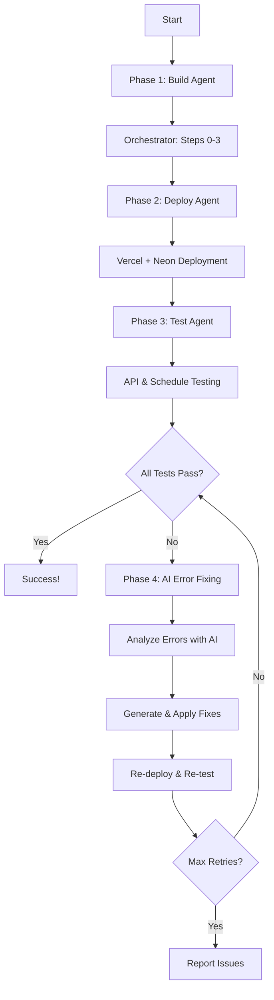

# Testing Agent - Complete Agent Build, Deploy & Test System

The Testing Agent is a comprehensive system that orchestrates the complete agent building process, deploys it to production, tests all functionality, and uses AI to continuously fix errors until everything works properly.

## 🎯 What It Does

The Testing Agent automates the entire lifecycle of agent development:

1. **🔧 Build**: Uses the orchestrator to generate database schema, actions, and schedules
2. **🚀 Deploy**: Automatically deploys to Vercel with Neon PostgreSQL database  
3. **🧪 Test**: Comprehensively tests all API endpoints and scheduled tasks
4. **🤖 Fix**: Uses AI to analyze errors and generate specific code fixes
5. **🔄 Iterate**: Continues fixing and re-testing until everything works

## 🚀 Quick Start

### Prerequisites

Set up the required environment variables:

```bash
# Required for deployment
VERCEL_TOKEN=your_vercel_token_here
NEON_API_KEY=your_neon_api_key_here

# Required for AI operations
OPENAI_API_KEY=your_openai_api_key_here

# Optional: For enhanced AI capabilities
ANTHROPIC_API_KEY=your_anthropic_key_here
GROK_API_KEY=your_grok_key_here
```

### Run the Testing Agent

```bash
# Basic usage
npm run test-agent "Create a task management system"

# More complex examples
npm run test-agent "Build a fitness tracking app with workouts and nutrition logging"
npm run test-agent "Create a content creation platform for bloggers with AI assistance"
npm run test-agent "Build an inventory management system for small businesses"
npm run test-agent "Create a customer support ticket system with priority handling"
```

### Example Output

```
🚀 Starting Testing Agent...
📝 Request: Create a task management system
⏳ This may take several minutes for complete build, deploy, and test cycle...

[10:30:15] 🔧 Phase 1: Building agent with orchestrator...
[10:30:16] Step step0: processing - Executing comprehensive analysis...
[10:30:45] Step step0: complete - Analysis completed: 3 models, 5 actions, 2 schedules
[10:31:00] Step step1: processing - Generating database schema...
[10:31:30] Step step1: complete - Database generated: 3 models
[10:31:45] Step step2: processing - Generating actions...
[10:32:15] Step step2: complete - Actions generated: 5 actions with medium complexity
[10:32:30] Step step3: processing - Generating schedules...
[10:32:45] Step step3: complete - Schedules generated: 2 schedules with low complexity

[10:32:46] 🚀 Phase 2: Deploying agent to Vercel + Neon...
[10:32:47] Deployment: 🗄️ Creating Neon PostgreSQL database...
[10:33:15] Deployment: ✅ Neon database created successfully
[10:33:16] Deployment: 🚀 Creating Vercel project...
[10:33:45] Deployment: 📁 Generating project files...
[10:34:00] Deployment: 🔧 Configuring environment variables...
[10:34:30] Deployment: 🚀 Uploading and deploying to Vercel...
[10:35:00] Deployment: ⏳ Waiting for Vercel to build and deploy...
[10:37:30] Deployment: 🎉 Deployment successfully completed and is live!

[10:37:31] 🧪 Phase 3: Testing deployed agent APIs...
[10:37:32] 🧪 Testing 5 API endpoints...
[10:37:35] ✅ API createTask: 245ms
[10:37:38] ✅ API updateTask: 189ms
[10:37:41] ✅ API deleteTask: 156ms
[10:37:44] ✅ API getTasks: 123ms
[10:37:47] ✅ API getTaskAnalytics: 298ms
[10:37:48] ⏰ Testing 2 schedule endpoints...
[10:37:51] ✅ Schedule dailyTaskReport: OK
[10:37:54] ✅ Schedule weeklyCleanup: OK
[10:37:55] 📊 Test Summary: 7/7 passed (healthy)

🎉 SUCCESS! Agent is live and working!
🌐 Deployment URL: https://test-agent-1234567890.vercel.app
⚡ API Endpoints: 5
⏰ Schedules: 2
🔧 Fix Attempts: 0

================================================================================
📊 TESTING AGENT RESULTS
================================================================================
⏱️  Total Execution Time: 7m 23s
🎯 Overall Success: ✅ YES
🏥 System Health: HEALTHY
🌐 Deployment URL: https://test-agent-1234567890.vercel.app
📋 Agent Name: Task Management System
🏷️  Domain: productivity
📊 Database Models: 3
⚡ Actions: 5
⏰ Schedules: 2

📋 TEST RESULTS:
   API Tests: 5
   ✅ Successful: 5/5
   Schedule Tests: 2
   ✅ Successful: 2/2

⚡ API ENDPOINTS:
   1. ✅ createTask (245ms)
   2. ✅ updateTask (189ms)
   3. ✅ deleteTask (156ms)
   4. ✅ getTasks (123ms)
   5. ✅ getTaskAnalytics (298ms)

⏰ SCHEDULE ENDPOINTS:
   1. ✅ dailyTaskReport
   2. ✅ weeklyCleanup

================================================================================
🎉 Testing Agent completed successfully!
🚀 Your agent is deployed and all APIs are working!
🌐 Visit: https://test-agent-1234567890.vercel.app
```

## 🏗️ Architecture

### Core Components

1. **TestingAgent Class** (`src/lib/ai/tools/agent-builder/testing-agent.ts`)
   - Main orchestrator that coordinates the entire testing process
   - Manages the 4-phase execution pipeline
   - Handles progress reporting and error management

2. **AIErrorFixer Class** (`src/lib/ai/tools/agent-builder/ai-fixer.ts`)
   - Advanced AI-powered error analysis and fixing
   - Groups similar errors for efficient processing
   - Generates specific code changes and fixes

3. **Test Script** (`scripts/test-agent.ts`)
   - Command-line interface for easy usage
   - Environment validation and setup
   - Comprehensive result reporting

### Execution Flow



## 🧪 Testing Capabilities

### API Endpoint Testing

The Testing Agent automatically tests all generated API endpoints:

- **Request Generation**: Creates appropriate test parameters based on action names and patterns
- **Response Validation**: Checks HTTP status codes and response formats
- **Performance Monitoring**: Measures response times for each endpoint
- **Error Detection**: Captures and analyzes API errors for fixing

### Schedule Testing

Tests all generated scheduled tasks:

- **Direct Invocation**: Calls cron endpoints directly to verify functionality
- **Authentication**: Tests with proper cron secrets and authorization
- **Error Handling**: Validates error responses and timeout handling

### Health Assessment

Calculates overall system health:

- **Healthy**: All tests pass (100% success rate)
- **Degraded**: Most tests pass (>50% success rate)  
- **Failed**: Most tests fail (≤50% success rate)

## 🤖 AI-Powered Error Fixing

### Error Analysis

The AI system analyzes errors across multiple dimensions:

1. **Error Grouping**: Similar errors are grouped together for efficient analysis
2. **Root Cause Analysis**: Identifies the fundamental issues causing problems
3. **Impact Assessment**: Determines severity and affected components
4. **Fix Generation**: Creates specific, actionable code changes

### Fix Types

The system can generate fixes for:

- **Code Issues**: API route handlers, Prisma queries, TypeScript errors
- **Configuration Problems**: Environment variables, deployment settings
- **Database Issues**: Schema mismatches, connection problems
- **Environment Setup**: Missing variables, incorrect formats

### Example AI Analysis

```json
{
  "errorType": "api",
  "severity": "high", 
  "rootCause": "API route handler missing proper export statement",
  "affectedComponents": ["src/app/api/createTask/route.ts"],
  "suggestedFixes": [
    {
      "type": "code",
      "description": "Add missing POST export to API route",
      "filePath": "src/app/api/createTask/route.ts",
      "changes": [
        {
          "operation": "replace",
          "oldCode": "async function handler(request) {",
          "newCode": "export async function POST(request: Request) {",
          "explanation": "Next.js App Router requires named exports for HTTP methods"
        }
      ],
      "priority": 9,
      "estimatedImpact": "high"
    }
  ],
  "confidence": 95
}
```

## 🔧 Configuration Options

### TestingAgentConfig

```typescript
interface TestingAgentConfig {
  userRequest: string;           // The agent description/request
  projectName?: string;          // Custom project name (auto-generated if not provided)
  maxRetries?: number;           // Maximum fix attempts (default: 5)
  testTimeout?: number;          // API test timeout in ms (default: 30000)
  enableDeployment?: boolean;    // Enable deployment phase (default: true)
  enableAIFixes?: boolean;       // Enable AI error fixing (default: true)
  onProgress?: (message: string) => void;     // Progress callback
  onError?: (error: string, context: any) => void;  // Error callback
  onSuccess?: (result: TestingResult) => void;      // Success callback
}
```

### Environment Variables

#### Required
- `VERCEL_TOKEN`: Vercel API token for deployment
- `NEON_API_KEY`: Neon database API key
- `OPENAI_API_KEY`: OpenAI API key for AI operations

#### Optional
- `ANTHROPIC_API_KEY`: Anthropic API key for enhanced AI
- `GROK_API_KEY`: Grok API key for alternative AI models
- `DEBUG`: Set to enable detailed error logging

## 📊 Results and Reporting

### TestingResult Interface

```typescript
interface TestingResult {
  success: boolean;                    // Overall success status
  orchestratorResult?: OrchestratorResult;  // Agent building results
  deploymentResult?: Step4Output;           // Deployment results  
  testResults: {                           // Testing results
    apiTests: APITestResult[];
    scheduleTests: ScheduleTestResult[];
    overallHealth: 'healthy' | 'degraded' | 'failed';
  };
  fixAttempts: FixAttempt[];              // AI fix attempts
  finalAgent?: AgentData;                 // Final agent configuration
  deploymentUrl?: string;                 // Live deployment URL
  executionTime: number;                  // Total execution time in ms
  errors: string[];                       // Any errors encountered
  warnings: string[];                     // Warning messages
}
```

### Detailed Test Results

Each API and schedule test provides comprehensive information:

```typescript
interface APITestResult {
  endpoint: string;           // Full API endpoint URL
  action: AgentAction;        // Action configuration
  status: 'success' | 'error' | 'timeout';
  responseTime?: number;      // Response time in milliseconds
  response?: any;             // Response data (if successful)
  error?: string;             // Error message (if failed)
  httpStatus?: number;        // HTTP status code
}
```

## 🎛️ Advanced Usage

### Programmatic Usage

```typescript
import { runTestingAgent } from './src/lib/ai/tools/agent-builder/testing-agent';

const result = await runTestingAgent({
  userRequest: "Create a project management system",
  maxRetries: 3,
  enableAIFixes: true,
  onProgress: (message) => console.log(`Progress: ${message}`),
  onError: (error) => console.error(`Error: ${error}`),
  onSuccess: (result) => console.log(`Success! URL: ${result.deploymentUrl}`)
});

if (result.success) {
  console.log(`Deployed to: ${result.deploymentUrl}`);
  console.log(`API Tests: ${result.testResults.apiTests.length}`);
  console.log(`Health: ${result.testResults.overallHealth}`);
}
```

### Custom Fix Logic

Extend the AI fixer for custom fix logic:

```typescript
import { AIErrorFixer } from './src/lib/ai/tools/agent-builder/ai-fixer';

class CustomAIFixer extends AIErrorFixer {
  async applyCustomFix(fix: Fix): Promise<boolean> {
    // Custom fix implementation
    // Read files, apply changes, validate results
    return true;
  }
}
```

## 🛠️ Development and Debugging

### Debug Mode

Enable debug mode for detailed logging:

```bash
DEBUG=1 npm run test-agent "Your request here"
```

### Manual Testing

Test individual components:

```typescript
// Test only the orchestrator
import { executeAgentGeneration } from './src/lib/ai/tools/agent-builder/steps/orchestrator';

const result = await executeAgentGeneration({
  userRequest: "Create a simple blog system",
  enableValidation: true
});

// Test only deployment
import { executeStep4VercelDeployment } from './src/lib/ai/tools/agent-builder/steps/step4-vercel-deployment';

const deployment = await executeStep4VercelDeployment({
  step1Output: result.stepResults.step1!,
  step2Output: result.stepResults.step2!,
  step3Output: result.stepResults.step3!,
  projectName: "test-blog"
});
```

### Error Analysis

Analyze errors manually:

```typescript
import { analyzeAndFixErrors } from './src/lib/ai/tools/agent-builder/ai-fixer';

const { analyses, fixAttempts } = await analyzeAndFixErrors(
  ["API endpoint returns 500 error", "Database connection failed"],
  testResults,
  agentData,
  deploymentUrl
);
```

## 📋 Common Use Cases

### 1. Development Testing
Quickly test new agent configurations during development:

```bash
npm run test-agent "Create a simple todo app with user authentication"
```

### 2. CI/CD Integration
Integrate into continuous integration pipelines:

```bash
# In your CI script
npm run test-agent "$AGENT_DESCRIPTION" || exit 1
```

### 3. Quality Assurance
Ensure agent quality before manual review:

```bash
npm run test-agent "Complex e-commerce system with inventory and orders"
```

### 4. Debugging Production Issues
Test fixes for production problems:

```bash
npm run test-agent "Reproduce the user management bug from production"
```

## 🚨 Troubleshooting

### Common Issues

1. **Environment Variables Missing**
   ```
   ❌ Missing required environment variables: VERCEL_TOKEN, NEON_API_KEY
   ```
   **Solution**: Set all required environment variables

2. **Deployment Timeout**
   ```
   ⚠️ Deployment timed out, but may still be building...
   ```
   **Solution**: Check Vercel dashboard, increase timeout, or retry

3. **API Test Failures**
   ```
   ❌ API createUser: HTTP 500: Internal Server Error
   ```
   **Solution**: Enable AI fixes or check deployment logs

4. **AI Analysis Failed**
   ```
   ❌ AI error analysis failed: Rate limit exceeded
   ```
   **Solution**: Wait and retry, or check API key quotas

### Getting Help

- Check the deployment URL directly in browser
- Review Vercel deployment logs
- Enable DEBUG mode for detailed logging
- Check environment variable configuration
- Verify API keys and permissions

## 🔮 Future Enhancements

- **Real File Modification**: Actually apply AI-generated fixes to files
- **Advanced Testing**: Integration tests, performance tests, security tests
- **Multi-Provider Support**: Support for different deployment platforms
- **Test Coverage Analysis**: Measure and improve test coverage
- **Custom Test Scenarios**: User-defined test cases and scenarios
- **Monitoring Integration**: Connect with monitoring and alerting systems

---

The Testing Agent represents a significant step forward in automated agent development, providing end-to-end testing and AI-powered error resolution. It ensures that generated agents work correctly in production environments while continuously improving through intelligent error analysis and fixing. 