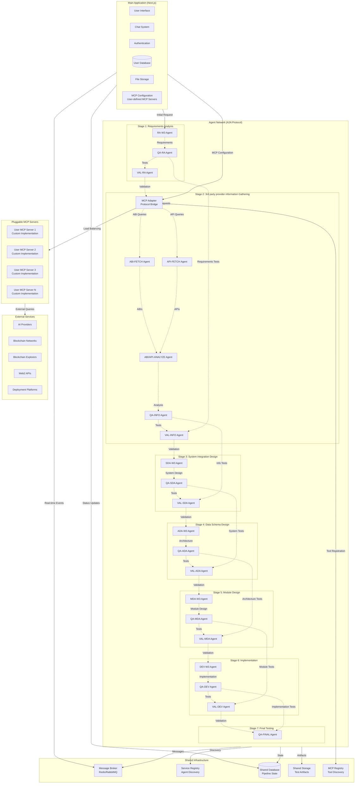
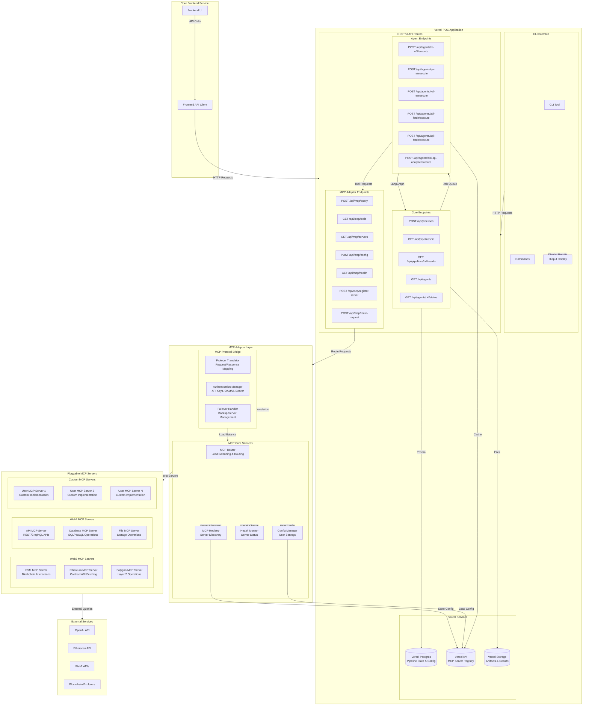

# Multi-Agent System Architecture with Pluggable MCP Protocol and A2A Protocol

## Overview

This document describes the architecture of a decentralized multi-agent system for Web3 application generation, featuring:
- **A2A (Agent-to-Agent) Protocol** for decentralized communication
- **Pluggable MCP (Model Context Protocol) Interface** for customizable information gathering
- **V-Model Test-Driven Development** approach
- **7-Stage Pipeline** for Web3 application generation

## High-Level System Architecture



### Workflows

#### **automatic generate**
- user journey:
  ```
  - user send a request with description about the app they want
  - user wait a few minutes
  - user get an fully-functional and well-tested app with the functionality fullfilling the given requirement description
  ```
- required endpoint:
  - `/api/agent/generate?description=...`

#### **user interaction**
- user journey:
  ```
  - user send a request with description about the app they want
  - Stage 1 - user get:
    - formatted requirements, extracted business logic, identified web3 contracts, identified web2 APIs
      - user can modify directly
    - acceptance tests, business logic validation tests
      - user can add comment and trigger regenerate
  - once user is happy with the results of stage 1, trigger stage 2 generate
  - Stage 2 - user get:
    - ABI/API analyzed results
      - user can add comment and trigger regenerate
    - tests for information gathering, validates data completeness
      - user can add comment and trigger regenerate
  - once user is happy with the results of stage 2, trigger stage 3 generate
  - Stage 3 - user get:
    - system architecture (3rd party integration) and Action Ideas
      - user can modify directly
    - system E2E tests
      - user can add comment and trigger regenerate
  - once user is happy with the results of stage 3, trigger stage 4 generate
  - Stage 4 - user get:
    - Data Schemas and API integration plans 
      - user can add comment and trigger regenerate
    - system integrational tests
      - user can add comment and trigger regenerate
  - once user is happy with the results of stage 4, trigger stage 5 generate
  - Stage 5 - user get:
    - model CRUD and API adaptor classes and integration flows ( steps in actions)
      - user can add comment and trigger regenerate
    - module tests, component tests, API endpoint tests
      - user can add comment and trigger regenerate
  - once user is happy with the results of stage 5, trigger stage 6 generate
  - Stage 6 - user get:
    - code
      - user can add comment and trigger regenerate
    - unit tests
      - user can add comment and trigger regenerate
  - once user is happy with the results of stage 6, trigger stage 7 and run all tests
  - user gets well-tested code and app

  ```


### Core Agents

#### **Stage 1: Requirements Analysis**
- **RA-W3 Agent**: Analyzes user requirements, extracts business logic, and identifies Web3 contract and web2 API requirements, 
- **QA-RA Agent**: Generates acceptance tests, business logic validation tests
- **VAL-RA Agent (can be replaced by user)**: 
  - Validates if the analyzed results meet user requirements, if not, ask RA-W3 Agent to regenerate the analyzed results
  - Validates if test scenarios cover the analyzed results, if not, ask QA-RA Agent to regenerate the tests

#### **Stage 2: 3rd party provider information Gathering**
- **MCP Adapter**: Protocol bridge that routes requests to user-defined MCP servers, manages load balancing and failover
- **ABI-FETCH Agent**: Queries blockchain explorers through MCP adapter, fetches verified contract ABIs, validates contract addresses
- **API-FETCH Agent**: Discovers and fetches Web2 API specifications through MCP adapter, validates API endpoints
- **ABI/API-ANALYZE Agent**: Analyzes contract interfaces, maps functions and events, analyzes gas costs
- **QA-INFO Agent**: Generates tests for information gathering, validates data completeness
- **VAL-INFO Agent (can be replaced by user)**: 
  - Validates if the ABI/API analyzed results meet test requirements from stage 1, if not, ask ABI/API-ANALYZE Agent to regenerate the analyzed results
  - Validates if test scenarios cover the analyzed results, if not, ask QA-INFO Agent to regenerate the tests

#### **Stage 3: System integration Design**
- **SDA-W3 Agent**: Generates system architecture (3rd party integration diagram depicted in mermaid) and Action Ideas
- **QA-SDA Agent**: Generates system E2E tests
- **VAL-SDA Agent**: 
  - Validates if the system architecture, Action Ideas meet test requirements from stage 1, if not, ask SDA-W3 Agent to regenerate the design
  - Validates if E2E test scenarios cover the SDA-W3 Agent results, if not, ask QA-SDA Agent to regenerate the tests

#### **Stage 4: Data Schema Design**
- **ADA-W3 Agent**: Generates Data Schemas and API integration plans 
- **QA-ADA Agent**: Generates system integrational tests
- **VAL-ADA Agent**: 
  - Validates if the Data Schemas and API integration plans meet test requirements from stage 3, if not, ask ADA-W3 Agent to regenerate the design
  - Validates if system integrational tests cover the ADA-W3 Agent results, if not, ask QA-ADA Agent to regenerate the tests

#### **Stage 5: Module Design**
- **MDA-W3 Agent**: Designs model CRUD and API adaptor classes and integration flows (steps in actions)
- **QA-MDA Agent**: Generates module tests, component tests, API endpoint tests
- **VAL-MDA Agent**:
  - Validates if the model CRUD and API adaptor classes and integration flows (steps in actions) meet test requirements from stage 4, if not, ask MDA-W3 Agent to regenerate the design
  - Validates if module tests, component tests, API endpoint tests cover the MDA-W3 Agent results, if not, ask QA-MDA Agent to regenerate the tests

#### **Stage 6: Implementation**
- **DEV-W3 Agent**: Implements code
- **QA-DEV Agent**: Generates unit tests
- **VAL-DEV Agent**:
  - Validates if the code meets test requirements from stage 5, if not, ask DEV-W3 Agent to regenerate the code
  - Validates if unit tests cover the DEV-W3 Agent results, if not, ask QA-DEV Agent to regenerate the tests

#### **Stage 7: Final Testing**
- **QA-FINAL Agent**: Executes comprehensive testing, performs cross-stage integration tests

### MCP Adapter Role

The MCP Adapter serves as a protocol bridge between the agent network and pluggable MCP servers with the following responsibilities:

1. **Protocol Translation**: Translates agent requests to appropriate MCP server calls
2. **Load Balancing**: Routes requests to appropriate MCP servers based on routing rules
3. **Server Management**: Manages multiple user-defined MCP server instances
4. **Plugin Orchestration**: Coordinates between different MCP server plugins
5. **Fallback Handling**: Provides automatic failover to backup servers
6. **Health Monitoring**: Monitors the health and status of all MCP servers
7. **Configuration Management**: Handles user-defined MCP server configurations
8. **Tool Aggregation**: Aggregates tools from multiple MCP servers into a unified interface

### Pluggable MCP Server System

The pluggable MCP server system allows users to define their own MCP server connections with the following capabilities:

1. **Custom MCP Servers**: Users can implement their own MCP server plugins
2. **Multiple Server Support**: Support for multiple MCP server instances simultaneously
3. **Custom Authentication**: Different authentication methods per server (API keys, OAuth2, Bearer tokens)
4. **Routing Rules**: Custom routing based on tool types, networks, or other criteria
5. **Load Balancing**: Round-robin, least connections, or weighted routing strategies
6. **Failover Mechanisms**: Automatic failover to backup servers on failure
7. **Health Monitoring**: Continuous health checks and status monitoring
8. **Configuration Management**: JSON-based configuration for easy setup and management

## Agent Interactions

### A2A Protocol Implementation

#### **Message Types**
1. **REQUEST**: Agent requests service from another agent
2. **RESPONSE**: Agent responds to a request
3. **EVENT**: Agent broadcasts an event to interested agents
4. **BROADCAST**: Agent sends message to all agents
5. **HEARTBEAT**: Agent reports its health status
6. **DISCOVERY**: Agent discovers other agents and their capabilities

#### **Communication Patterns**

1. **Request-Response Pattern**
   - RA-W3 → QA-RA: "Generate tests for these requirements"
   - QA-RA → RA-W3: "Here are the generated tests"

2. **Event-Driven Pattern**
   - MCP Adapter → All Agents: "New ABI data available from MCP server"
   - Agents subscribe to relevant events from MCP adapter

3. **Publish-Subscribe Pattern**
   - QA agents publish test results
   - Validator agents subscribe to test results

4. **Service Discovery Pattern**
   - Agents discover each other through service registry
   - Load balancing across multiple instances

### Cross-Stage Test Flow

1. **Stage 1 → Stage 2**: Requirements tests validate information gathering
2. **Stage 2 → Stage 3**: Information tests validate system design
3. **Stage 3 → Stage 4**: System tests validate data schema design
4. **Stage 4 → Stage 5**: Data schema tests validate module design
5. **Stage 5 → Stage 6**: Module tests validate implementation
6. **Stage 6 → Stage 7**: Implementation tests validate final application

## POC Implementation Strategy

### Overview

This section focuses on the **easiest way to prove our multi-agent system concept** using Vercel's built-in tools and widely-adopted JavaScript libraries. The goal is to create a working POC in 2-3 weeks with minimal complexity.

### Recommended JavaScript Libraries (Researched & Battle-tested)

#### **Agent Orchestration & Communication**
- **LangGraph** (`@langchain/langgraph`) - **RECOMMENDED**
  - Purpose: Agent workflow orchestration
  - Why: Built specifically for multi-agent systems, excellent TypeScript support
  - Stars: 15k+, Active development by LangChain team
  - Alternative: **AutoGen** (`autogen`) for conversation-based agents

#### **MCP Protocol Implementation**
- **Official MCP SDK** (`@modelcontextprotocol/sdk`) - **RECOMMENDED**
  - Purpose: Model Context Protocol implementation for pluggable MCP servers
  - Why: Official SDK, full protocol compliance, supports custom server implementations
  - Stars: 2k+, Official Microsoft/OpenAI project
  - Alternative: **Custom MCP adapter implementation** using Express.js with plugin system
- **EVM MCP Server** (https://github.com/mcpdotdirect/evm-mcp-server)


#### **Database & State Management**
- **Prisma** (`@prisma/client`) - **RECOMMENDED**
  - Purpose: Database ORM and migrations
  - Why: Excellent TypeScript support, Vercel Postgres integration
  - Stars: 35k+, Industry standard
  - Alternative: **Drizzle ORM** for lighter weight

#### **Real-time Communication**
- **Socket.io** (`socket.io`) - **RECOMMENDED**
  - Purpose: Real-time updates and agent communication
  - Why: Battle-tested, works great with Vercel
  - Stars: 58k+, Industry standard
  - Alternative: **Server-Sent Events** for simpler use cases

#### **Message Queue & Caching**
- **Bull** (`bull`) - **RECOMMENDED**
  - Purpose: Job queue for agent tasks
  - Why: Redis-based, excellent for serverless
  - Stars: 14k+, Production-ready
  - Alternative: **Vercel KV** for simple key-value storage

#### **Web3 Integration**
- **Ethers.js** (`ethers`) - **RECOMMENDED**
  - Purpose: Ethereum/Web3 interactions
  - Why: Industry standard, excellent ABI handling
  - Stars: 7k+, Most popular Web3 library
  - Alternative: **viem** for newer, lighter alternative

#### **CLI Development**
- **Commander.js** (`commander`) - **RECOMMENDED**
  - Purpose: CLI interface development
  - Why: Industry standard, excellent TypeScript support
  - Stars: 25k+, Most popular CLI framework
  - Alternative: **Yargs** for more complex CLI applications

#### **API Development**
- **Next.js API Routes** - **RECOMMENDED**
  - Purpose: RESTful API endpoints
  - Why: Built into Next.js, perfect for Vercel
  - Alternative: **Express.js** for more complex routing

#### **Testing**
- **Jest** (`jest`) - **RECOMMENDED**
  - Purpose: Unit and integration testing
  - Why: Industry standard, excellent TypeScript support
  - Stars: 42k+, Facebook/Meta backed
  - Alternative: **Vitest** for faster testing

#### **Validation & Schema**
- **Zod** (`zod`) - **RECOMMENDED**
  - Purpose: Runtime type validation
  - Why: TypeScript-first, excellent error messages
  - Stars: 25k+, Industry standard
  - Alternative: **Joi** for more traditional validation

### POC Architecture (CLI + RESTful APIs with Pluggable MCP Design)


