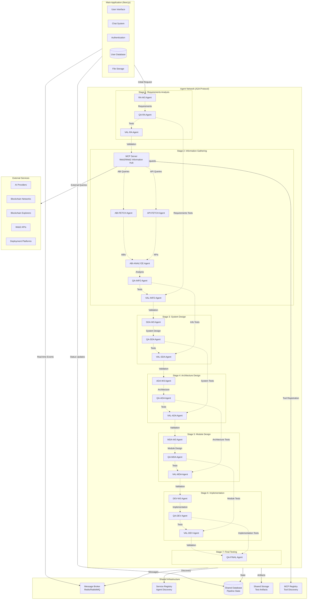
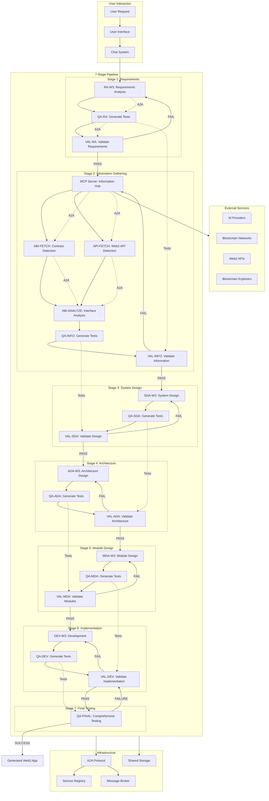
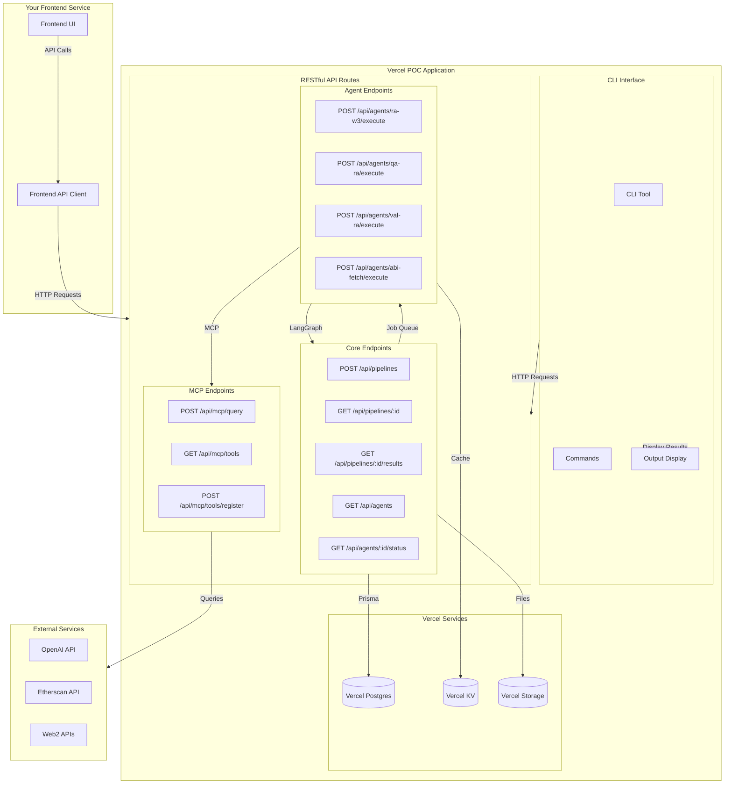

# Multi-Agent System Architecture with MCP Server and A2A Protocol

## Overview

This document describes the architecture of a decentralized multi-agent system for Web3 application generation, featuring:
- **A2A (Agent-to-Agent) Protocol** for decentralized communication
- **MCP (Model Context Protocol) Server** for Web3/Web2 information gathering
- **V-Model Test-Driven Development** approach
- **7-Stage Pipeline** for Web3 application generation

## High-Level System Architecture



## System Flow Chart



## Role Definitions

### Core Agents

#### **Stage 1: Requirements Analysis**
- **RA-W3 Agent**: Analyzes user requirements, identifies Web3 components, extracts business logic
- **QA-RA Agent**: Generates acceptance tests, business logic validation tests, Web3 requirement coverage tests
- **VAL-RA Agent**: Validates requirements against test scenarios, verifies blockchain selections

#### **Stage 2: Information Gathering**
- **MCP Server**: Central information hub for Web3/Web2 data, provides tool discovery and lookup services
- **ABI-FETCH Agent**: Queries blockchain explorers, fetches verified contract ABIs, validates contract addresses
- **API-FETCH Agent**: Discovers and fetches Web2 API specifications, validates API endpoints
- **ABI-ANALYZE Agent**: Analyzes contract interfaces, maps functions and events, analyzes gas costs
- **QA-INFO Agent**: Generates tests for information gathering, validates data completeness
- **VAL-INFO Agent**: Validates gathered information against requirements tests

#### **Stage 3: System Design**
- **SDA-W3 Agent**: Designs system architecture, plans event listeners, defines transaction patterns
- **QA-SDA Agent**: Generates system integration tests, service layer tests, event listener tests
- **VAL-SDA Agent**: Validates system design against information tests

#### **Stage 4: Architecture Design**
- **ADA-W3 Agent**: Selects technology stack, chooses frameworks, defines deployment strategy
- **QA-ADA Agent**: Generates framework compatibility tests, provider integration tests
- **VAL-ADA Agent**: Validates architecture against system tests

#### **Stage 5: Module Design**
- **MDA-W3 Agent**: Designs modules, creates API specifications, defines data schemas
- **QA-MDA Agent**: Generates module tests, component tests, API endpoint tests
- **VAL-MDA Agent**: Validates module design against architecture tests

#### **Stage 6: Implementation**
- **DEV-W3 Agent**: Implements code, creates database schemas, builds API endpoints
- **QA-DEV Agent**: Generates unit tests, integration tests, end-to-end tests
- **VAL-DEV Agent**: Validates implementation against module tests

#### **Stage 7: Final Testing**
- **QA-FINAL Agent**: Executes comprehensive testing, performs cross-stage integration tests

### MCP Server Role

The MCP Server serves as the central information hub with the following responsibilities:

1. **Tool Discovery**: Registers and discovers available tools for Web3/Web2 information gathering
2. **ABI Management**: Provides standardized interface for querying blockchain contract ABIs
3. **API Management**: Provides standardized interface for discovering and accessing Web2 APIs
4. **Data Caching**: Caches frequently accessed data to improve performance
5. **Tool Orchestration**: Coordinates between different information gathering tools
6. **Data Validation**: Validates and normalizes data from various sources
7. **Rate Limiting**: Manages API rate limits and quotas
8. **Error Handling**: Provides fallback mechanisms and error recovery

## Agent Interactions

### A2A Protocol Implementation

#### **Message Types**
1. **REQUEST**: Agent requests service from another agent
2. **RESPONSE**: Agent responds to a request
3. **EVENT**: Agent broadcasts an event to interested agents
4. **BROADCAST**: Agent sends message to all agents
5. **HEARTBEAT**: Agent reports its health status
6. **DISCOVERY**: Agent discovers other agents and their capabilities

#### **Communication Patterns**

1. **Request-Response Pattern**
   - RA-W3 → QA-RA: "Generate tests for these requirements"
   - QA-RA → RA-W3: "Here are the generated tests"

2. **Event-Driven Pattern**
   - MCP Server → All Agents: "New ABI data available"
   - Agents subscribe to relevant events

3. **Publish-Subscribe Pattern**
   - QA agents publish test results
   - Validator agents subscribe to test results

4. **Service Discovery Pattern**
   - Agents discover each other through service registry
   - Load balancing across multiple instances

### Cross-Stage Test Flow

1. **Stage 1 → Stage 2**: Requirements tests validate information gathering
2. **Stage 2 → Stage 3**: Information tests validate system design
3. **Stage 3 → Stage 4**: System tests validate architecture choices
4. **Stage 4 → Stage 5**: Architecture tests validate module design
5. **Stage 5 → Stage 6**: Module tests validate implementation
6. **Stage 6 → Stage 7**: Implementation tests validate final application

## POC Implementation Strategy

### Overview

This section focuses on the **easiest way to prove our multi-agent system concept** using Vercel's built-in tools and widely-adopted JavaScript libraries. The goal is to create a working POC in 2-3 weeks with minimal complexity.

### Recommended JavaScript Libraries (Researched & Battle-tested)

#### **Agent Orchestration & Communication**
- **LangGraph** (`@langchain/langgraph`) - **RECOMMENDED**
  - Purpose: Agent workflow orchestration
  - Why: Built specifically for multi-agent systems, excellent TypeScript support
  - Stars: 15k+, Active development by LangChain team
  - Alternative: **AutoGen** (`autogen`) for conversation-based agents

#### **MCP Protocol Implementation**
- **Official MCP SDK** (`@modelcontextprotocol/sdk`) - **RECOMMENDED**
  - Purpose: Model Context Protocol implementation
  - Why: Official SDK, full protocol compliance
  - Stars: 2k+, Official Microsoft/OpenAI project
  - Alternative: **Custom MCP implementation** using Express.js

#### **Database & State Management**
- **Prisma** (`@prisma/client`) - **RECOMMENDED**
  - Purpose: Database ORM and migrations
  - Why: Excellent TypeScript support, Vercel Postgres integration
  - Stars: 35k+, Industry standard
  - Alternative: **Drizzle ORM** for lighter weight

#### **Real-time Communication**
- **Socket.io** (`socket.io`) - **RECOMMENDED**
  - Purpose: Real-time updates and agent communication
  - Why: Battle-tested, works great with Vercel
  - Stars: 58k+, Industry standard
  - Alternative: **Server-Sent Events** for simpler use cases

#### **Message Queue & Caching**
- **Bull** (`bull`) - **RECOMMENDED**
  - Purpose: Job queue for agent tasks
  - Why: Redis-based, excellent for serverless
  - Stars: 14k+, Production-ready
  - Alternative: **Vercel KV** for simple key-value storage

#### **Web3 Integration**
- **Ethers.js** (`ethers`) - **RECOMMENDED**
  - Purpose: Ethereum/Web3 interactions
  - Why: Industry standard, excellent ABI handling
  - Stars: 7k+, Most popular Web3 library
  - Alternative: **viem** for newer, lighter alternative

#### **CLI Development**
- **Commander.js** (`commander`) - **RECOMMENDED**
  - Purpose: CLI interface development
  - Why: Industry standard, excellent TypeScript support
  - Stars: 25k+, Most popular CLI framework
  - Alternative: **Yargs** for more complex CLI applications

#### **API Development**
- **Next.js API Routes** - **RECOMMENDED**
  - Purpose: RESTful API endpoints
  - Why: Built into Next.js, perfect for Vercel
  - Alternative: **Express.js** for more complex routing

#### **Testing**
- **Jest** (`jest`) - **RECOMMENDED**
  - Purpose: Unit and integration testing
  - Why: Industry standard, excellent TypeScript support
  - Stars: 42k+, Facebook/Meta backed
  - Alternative: **Vitest** for faster testing

#### **Validation & Schema**
- **Zod** (`zod`) - **RECOMMENDED**
  - Purpose: Runtime type validation
  - Why: TypeScript-first, excellent error messages
  - Stars: 25k+, Industry standard
  - Alternative: **Joi** for more traditional validation

### POC Architecture (CLI + RESTful APIs)



### POC Implementation Plan

#### **Phase 1: Foundation (Week 1)**
**Goal: Basic infrastructure and core pipeline**

1. **Set up Vercel project**
   ```bash
   npx create-next-app@latest rom-ai-poc --typescript --tailwind --app
   cd rom-ai-poc
   ```

2. **Install core dependencies**
   ```bash
   npm install @langchain/langgraph @langchain/openai @prisma/client
   npm install @modelcontextprotocol/sdk ethers socket.io bull
   npm install commander zod jest @types/jest
   ```

3. **Configure Vercel services**
   - Set up Vercel Postgres
   - Set up Vercel KV (Redis)
   - Set up Vercel Storage

4. **Create basic database schema**
   ```sql
   -- Simple pipeline tracking
   CREATE TABLE pipelines (
     id VARCHAR(255) PRIMARY KEY,
     user_id VARCHAR(255),
     status VARCHAR(50) DEFAULT 'pending',
     current_stage INTEGER DEFAULT 1,
     requirements JSONB,
     created_at TIMESTAMP DEFAULT NOW()
   );
   
   -- Agent results storage
   CREATE TABLE agent_results (
     id SERIAL PRIMARY KEY,
     pipeline_id VARCHAR(255) REFERENCES pipelines(id),
     agent_name VARCHAR(100),
     result JSONB,
     created_at TIMESTAMP DEFAULT NOW()
   );
   ```

#### **Phase 2: Core Agents (Week 2)**
**Goal: Implement basic agent workflow**

1. **Create LangGraph workflow**
   ```typescript
   // /lib/workflow.ts
   import { StateGraph } from "@langchain/langgraph";
   
   const workflow = new StateGraph({
     channels: {
       requirements: { value: null },
       ra_result: { value: null },
       qa_result: { value: null },
       val_result: { value: null }
     }
   });
   
   // Add basic nodes
   workflow.addNode("ra_w3", raW3Node);
   workflow.addNode("qa_ra", qaRANode);
   workflow.addNode("val_ra", valRANode);
   
   // Simple linear flow
   workflow.addEdge("ra_w3", "qa_ra");
   workflow.addEdge("qa_ra", "val_ra");
   
   export const app = workflow.compile();
   ```

2. **Implement basic agents**
   ```typescript
   // /api/agents/ra-w3/route.ts
   import { NextRequest, NextResponse } from 'next/server';
   import { ChatOpenAI } from "@langchain/openai";
   
   export async function POST(request: NextRequest) {
     const { requirements } = await request.json();
     
     const llm = new ChatOpenAI({ model: "gpt-4" });
     const result = await llm.invoke(`
       Analyze these Web3 requirements: ${JSON.stringify(requirements)}
       
       Extract:
       1. Target blockchain networks
       2. Smart contract requirements
       3. Business logic requirements
       
       Return as JSON.
     `);
     
     return NextResponse.json({ result: result.content });
   }
   ```

3. **Create simple MCP server**
   ```typescript
   // /api/mcp/route.ts
   import { NextRequest, NextResponse } from 'next/server';
   
   export async function POST(request: NextRequest) {
     const { action, params } = await request.json();
     
     switch (action) {
       case "query_abi":
         // Simple Etherscan API call
         const response = await fetch(
           `https://api.etherscan.io/api?module=contract&action=getabi&address=${params.contractAddress}`
         );
         const data = await response.json();
         return NextResponse.json(data);
         
       default:
         return NextResponse.json({ error: "Unknown action" }, { status: 400 });
     }
   }
   ```

#### **Phase 3: CLI & API Integration (Week 3)**
**Goal: End-to-end working pipeline with CLI interface**

1. **Create CLI interface**
   ```typescript
   // /bin/rom-ai-cli.ts
   #!/usr/bin/env node
   
   import { Command } from 'commander';
   import { z } from 'zod';
   
   const program = new Command();
   
   program
     .name('rom-ai')
     .description('Web3 Multi-Agent System CLI')
     .version('1.0.0');
   
   // Pipeline commands
   program
     .command('pipeline:create')
     .description('Create a new pipeline')
     .requiredOption('-r, --requirements <requirements>', 'Web3 requirements')
     .option('-u, --user-id <userId>', 'User ID')
     .action(async (options) => {
       try {
         const response = await fetch(`${process.env.API_BASE_URL}/api/pipelines`, {
           method: 'POST',
           headers: { 'Content-Type': 'application/json' },
           body: JSON.stringify({
             requirements: options.requirements,
             userId: options.userId
           })
         });
         
         const result = await response.json();
         console.log('✅ Pipeline created:', result.pipelineId);
         console.log('📊 Status:', result.status);
       } catch (error) {
         console.error('❌ Error creating pipeline:', error.message);
       }
     });
   
   program
     .command('pipeline:status')
     .description('Get pipeline status')
     .requiredOption('-i, --id <pipelineId>', 'Pipeline ID')
     .action(async (options) => {
       try {
         const response = await fetch(`${process.env.API_BASE_URL}/api/pipelines/${options.id}`);
         const result = await response.json();
         
         console.log('📊 Pipeline Status:');
         console.log(`   ID: ${result.id}`);
         console.log(`   Status: ${result.status}`);
         console.log(`   Stage: ${result.currentStage}`);
         console.log(`   Created: ${result.createdAt}`);
       } catch (error) {
         console.error('❌ Error getting pipeline status:', error.message);
       }
     });
   
   program
     .command('pipeline:results')
     .description('Get pipeline results')
     .requiredOption('-i, --id <pipelineId>', 'Pipeline ID')
     .action(async (options) => {
       try {
         const response = await fetch(`${process.env.API_BASE_URL}/api/pipelines/${options.id}/results`);
         const results = await response.json();
         
         console.log('📋 Pipeline Results:');
         results.forEach((result: any) => {
           console.log(`\n🔧 ${result.agentName}:`);
           console.log(JSON.stringify(result.result, null, 2));
         });
       } catch (error) {
         console.error('❌ Error getting pipeline results:', error.message);
       }
     });
   
   // Agent commands
   program
     .command('agent:execute')
     .description('Execute a specific agent')
     .requiredOption('-a, --agent <agentName>', 'Agent name (ra-w3, qa-ra, val-ra)')
     .requiredOption('-i, --input <input>', 'Agent input (JSON string)')
     .action(async (options) => {
       try {
         const response = await fetch(`${process.env.API_BASE_URL}/api/agents/${options.agent}/execute`, {
           method: 'POST',
           headers: { 'Content-Type': 'application/json' },
           body: JSON.stringify(JSON.parse(options.input))
         });
         
         const result = await response.json();
         console.log('✅ Agent execution completed:');
         console.log(JSON.stringify(result, null, 2));
       } catch (error) {
         console.error('❌ Error executing agent:', error.message);
       }
     });
   
   // MCP commands
   program
     .command('mcp:query')
     .description('Query MCP server')
     .requiredOption('-t, --type <type>', 'Query type (abi, api)')
     .requiredOption('-p, --params <params>', 'Query parameters (JSON string)')
     .action(async (options) => {
       try {
         const response = await fetch(`${process.env.API_BASE_URL}/api/mcp/query`, {
           method: 'POST',
           headers: { 'Content-Type': 'application/json' },
           body: JSON.stringify({
             type: options.type,
             params: JSON.parse(options.params)
           })
         });
         
         const result = await response.json();
         console.log('✅ MCP query result:');
         console.log(JSON.stringify(result, null, 2));
       } catch (error) {
         console.error('❌ Error querying MCP:', error.message);
       }
     });
   
   program.parse();
   ```

2. **Create RESTful API endpoints**
   ```typescript
   // /api/pipelines/route.ts
   import { NextRequest, NextResponse } from 'next/server';
   import { z } from 'zod';
   import { app } from '@/lib/workflow';
   
   const CreatePipelineSchema = z.object({
     requirements: z.string().min(1),
     userId: z.string().optional()
   });
   
   export async function POST(request: NextRequest) {
     try {
       const body = await request.json();
       const { requirements, userId } = CreatePipelineSchema.parse(body);
       
       const pipelineId = `pipeline_${Date.now()}_${Math.random().toString(36).substr(2, 9)}`;
       
       // Start workflow
       const result = await app.invoke({
         requirements,
         pipelineId,
         userId
       });
       
       return NextResponse.json({
         pipelineId,
         status: 'started',
         result
       });
     } catch (error) {
       return NextResponse.json(
         { error: error.message },
         { status: 400 }
       );
     }
   }
   
   // /api/pipelines/[id]/route.ts
   export async function GET(
     request: NextRequest,
     { params }: { params: { id: string } }
   ) {
     try {
       const pipeline = await getPipelineById(params.id);
       
       if (!pipeline) {
         return NextResponse.json(
           { error: 'Pipeline not found' },
           { status: 404 }
         );
       }
       
       return NextResponse.json(pipeline);
     } catch (error) {
       return NextResponse.json(
         { error: error.message },
         { status: 500 }
       );
     }
   }
   
   // /api/pipelines/[id]/results/route.ts
   export async function GET(
     request: NextRequest,
     { params }: { params: { id: string } }
   ) {
     try {
       const results = await getPipelineResults(params.id);
       return NextResponse.json(results);
     } catch (error) {
       return NextResponse.json(
         { error: error.message },
         { status: 500 }
       );
     }
   }
   ```

### POC File Structure

```
rom-ai-poc/
├── bin/
│   └── rom-ai-cli.ts          # CLI interface
├── api/
│   ├── pipelines/
│   │   ├── route.ts           # POST /api/pipelines
│   │   └── [id]/
│   │       ├── route.ts       # GET /api/pipelines/:id
│   │       └── results/
│   │           └── route.ts   # GET /api/pipelines/:id/results
│   ├── agents/
│   │   ├── ra-w3/
│   │   │   └── execute/
│   │   │       └── route.ts   # POST /api/agents/ra-w3/execute
│   │   ├── qa-ra/
│   │   │   └── execute/
│   │   │       └── route.ts   # POST /api/agents/qa-ra/execute
│   │   └── val-ra/
│   │       └── execute/
│   │           └── route.ts   # POST /api/agents/val-ra/execute
│   └── mcp/
│       ├── query/
│       │   └── route.ts       # POST /api/mcp/query
│       └── tools/
│           └── route.ts       # GET /api/mcp/tools
├── lib/
│   ├── workflow.ts            # LangGraph workflow
│   ├── agents/
│   │   ├── ra-w3.ts          # RA agent logic
│   │   ├── qa-ra.ts          # QA agent logic
│   │   └── val-ra.ts         # Validation agent logic
│   ├── mcp/
│   │   └── server.ts         # MCP server logic
│   ├── db.ts                 # Prisma client
│   └── api-client.ts         # API client utilities
├── prisma/
│   └── schema.prisma         # Database schema
├── package.json
├── vercel.json
└── README.md                 # CLI usage documentation
```

### POC Dependencies

```json
{
  "dependencies": {
    "@langchain/langgraph": "^0.0.20",
    "@langchain/openai": "^0.0.20",
    "@modelcontextprotocol/sdk": "^0.4.0",
    "@prisma/client": "^5.0.0",
    "ethers": "^6.8.0",
    "socket.io": "^4.7.0",
    "bull": "^4.12.0",
    "commander": "^11.0.0",
    "zod": "^3.22.0",
    "next": "14.0.0"
  },
  "devDependencies": {
    "@types/node": "^20.0.0",
    "@types/jest": "^29.0.0",
    "jest": "^29.0.0",
    "prisma": "^5.0.0",
    "typescript": "^5.0.0"
  },
  "bin": {
    "rom-ai": "./bin/rom-ai-cli.ts"
  }
}
```

### POC Environment Variables

```env
# .env.local
DATABASE_URL="postgresql://..."
KV_URL="redis://..."
STORAGE_URL="..."
OPENAI_API_KEY="sk-..."
ETHERSCAN_API_KEY="..."
VERCEL_URL="https://your-app.vercel.app"
API_BASE_URL="https://your-app.vercel.app"
```

### POC Success Criteria

#### **Week 1 Success:**
- ✅ Vercel project deployed
- ✅ Database schema created
- ✅ Basic API endpoints working
- ✅ LangGraph workflow compiles

#### **Week 2 Success:**
- ✅ RA-W3 agent processes requirements
- ✅ QA-RA agent generates tests
- ✅ VAL-RA agent validates results
- ✅ MCP server queries Etherscan

#### **Week 3 Success:**
- ✅ End-to-end pipeline works
- ✅ CLI interface functional
- ✅ RESTful APIs working
- ✅ Basic error handling

### POC Deployment

1. **Deploy to Vercel**
   ```bash
   vercel --prod
   ```

2. **Set up environment variables**
   ```bash
   vercel env add DATABASE_URL
   vercel env add OPENAI_API_KEY
   vercel env add ETHERSCAN_API_KEY
   vercel env add API_BASE_URL
   ```

3. **Deploy database**
   ```bash
   npx prisma db push
   ```

4. **Install CLI globally**
   ```bash
   npm install -g .
   ```

5. **Test CLI installation**
   ```bash
   rom-ai --help
   ```

### POC Testing Strategy

#### **CLI Testing**
```bash
# Test pipeline creation
rom-ai pipeline:create -r "Create a DeFi lending app on Ethereum" -u "user123"

# Test pipeline status
rom-ai pipeline:status -i "pipeline_1234567890_abc123"

# Test pipeline results
rom-ai pipeline:results -i "pipeline_1234567890_abc123"

# Test agent execution
rom-ai agent:execute -a "ra-w3" -i '{"requirements": "Create a DeFi app"}'

# Test MCP query
rom-ai mcp:query -t "abi" -p '{"contractAddress": "0x123...", "network": "ethereum"}'
```

#### **API Testing**
```bash
# Test pipeline creation
curl -X POST https://your-app.vercel.app/api/pipelines \
  -H "Content-Type: application/json" \
  -d '{"requirements": "Create a DeFi lending app", "userId": "user123"}'

# Test pipeline status
curl https://your-app.vercel.app/api/pipelines/pipeline_1234567890_abc123

# Test agent execution
curl -X POST https://your-app.vercel.app/api/agents/ra-w3/execute \
  -H "Content-Type: application/json" \
  -d '{"requirements": "Create a DeFi app"}'
```

#### **Automated Testing**
```typescript
// /__tests__/pipeline.test.ts
import { app } from '../lib/workflow';

describe('Pipeline Workflow', () => {
  test('should process Web3 requirements', async () => {
    const result = await app.invoke({
      requirements: {
        description: "Create a DeFi lending app",
        blockchain: "ethereum"
      }
    });
    
    expect(result.ra_result).toBeDefined();
    expect(result.qa_result).toBeDefined();
    expect(result.val_result).toBeDefined();
  });
});

// /__tests__/cli.test.ts
import { exec } from 'child_process';
import { promisify } from 'util';

const execAsync = promisify(exec);

describe('CLI Commands', () => {
  test('should create pipeline', async () => {
    const { stdout } = await execAsync(
      'rom-ai pipeline:create -r "Test requirements"'
    );
    expect(stdout).toContain('✅ Pipeline created:');
  });
});
```

### POC Limitations & Next Steps

#### **POC Limitations:**
- Only 3 agents (RA, QA, VAL)
- Basic MCP implementation
- Simple linear workflow
- Limited error handling
- No advanced features

#### **Post-POC Enhancements:**
- Add remaining agents
- Implement advanced MCP features
- Add complex workflow patterns
- Implement comprehensive testing
- Add monitoring and analytics

### Why This POC Approach Works

1. **Minimal Complexity**: Uses proven libraries, avoids custom implementations
2. **Vercel Native**: Leverages all Vercel services out of the box
3. **Fast Development**: 2-3 weeks to working prototype
4. **Scalable Foundation**: Easy to extend and enhance
5. **Industry Standard**: Uses battle-tested libraries
6. **Cost Effective**: Vercel's generous free tier
7. **Easy Deployment**: One-click deployment to production
8. **CLI-First**: Perfect for automation and integration with existing tools
9. **API-Ready**: RESTful APIs integrate seamlessly with your frontend service
10. **Developer Friendly**: CLI provides immediate feedback and testing capabilities

### CLI Usage Examples

```bash
# Create a new pipeline
rom-ai pipeline:create -r "Build a DeFi lending protocol on Ethereum with Aave integration"

# Check pipeline status
rom-ai pipeline:status -i pipeline_1234567890_abc123

# Get detailed results
rom-ai pipeline:results -i pipeline_1234567890_abc123

# Execute specific agent
rom-ai agent:execute -a "ra-w3" -i '{"requirements": "Create a DeFi app"}'

# Query MCP for ABI
rom-ai mcp:query -t "abi" -p '{"contractAddress": "0xA0b86a33E6441b8c4C8C8C8C8C8C8C8C8C8C8C8C", "network": "ethereum"}'
```

This POC approach provides the fastest path to proving your multi-agent system concept while building on a solid, scalable foundation with CLI and API interfaces that integrate perfectly with your existing frontend service.
