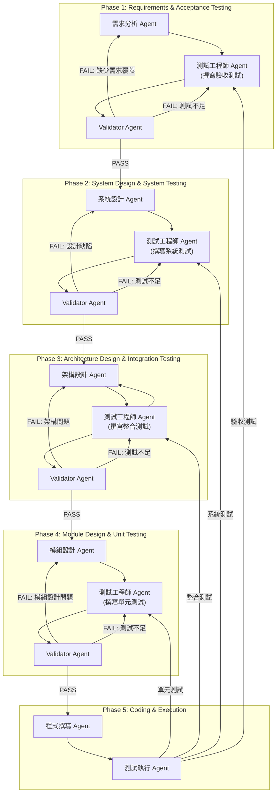

# V model

```
    Requirements
         |
   System Design
         |
   Architecture Design
         |
   Module Design
         |
     Coding
         |
    Unit Testing  <-- Module Design
         |
Integration Testing <-- Architecture Design
         |
System Testing <-- System Design
         |
Acceptance Testing <-- Requirements
```

### 左邊：開發階段（Verification）
**需求分析（Requirements Analysis）**  
蒐集用戶需求。

**系統設計（System Design）**  
整體架構設計。

**架構/高階設計（Architecture Design）**  
模組之間的互動設計。

**模組/詳細設計（Module Design）**  
各個元件的詳細邏輯。

**程式撰寫（Coding）**  
撰寫實際程式碼。

### 右邊：測試階段（Validation）
**單元測試（Unit Testing）**  
測試各個模組是否正確。

**整合測試（Integration Testing）**  
測試模組之間的整合與互動。

**系統測試（System Testing）**  
測試整個系統功能是否符合設計。

**驗收測試（Acceptance Testing）**  
測試是否符合用戶需求。


# V model with TDD in AI development

1. 需求分析  
```
你是一位產品經理，請根據以下 App 構想，幫我完成「需求分析」，內容包含：
1. 功能需求
2. 使用者角色
3. 使用者故事（User Stories）
4. 非功能需求

App 描述：
{{APP_DESCRIPTION}}
```
輸入內容：App 敘述
輸出：結構化需求列表（功能需求 / 使用者角色 / User Stories / 非功能需求）

2. 撰寫驗收測試  
```
你是一位 QA 專家，請根據以下需求分析，使用 Gherkin 語法撰寫「驗收測試」案例（Acceptance Tests）。
每個測試都要對應到一個使用者故事。

需求分析：
{{REQUIREMENTS}}
```
輸入內容：需求分析
輸出：Gherkin 語法的 Feature / Scenario

3. 根據驗收測試，做系統設計
```
你是一位系統架構師，請根據以下驗收測試，設計系統架構，包含：
1. 模組清單與職責
2. 資料流圖（Data Flow Diagram）
3. 系統組件間的關係描述

驗收測試：
{{ACCEPTANCE_TESTS}}
```
輸入內容：驗收測試
輸出：模組列表 + 資料流圖 + 關係描述

4. 撰寫系統測試  
```
你是一位軟體測試工程師，請根據以下系統設計，撰寫系統測試（System Tests）的測試案例（Python pytest 格式）。
這些測試必須驗證整個系統端到端運作是否正確。

系統設計：
{{SYSTEM_DESIGN}}
```
輸入內容：系統設計
輸出：pytest 格式的系統測試程式碼

5. 根據系統測試，做架構設計
```
你是一位系統架構師，請根據以下系統測試案例，設計高階架構（Architecture Design），內容包含：
1. 程式語言與主要框架
2. 外部 API / 第三方服務
3. 資料儲存方式
4. 部署方式與環境

系統測試：
{{SYSTEM_TESTS}}
```
輸入內容：系統測試
輸出：高階架構設計文件

6. 撰寫整合測試
```
你是一位測試工程師，請根據以下架構設計，撰寫整合測試（Integration Tests）。
整合測試需確保不同模組之間的資料傳遞與 API 呼叫正確。

架構設計：
{{ARCHITECTURE_DESIGN}}
```
輸入內容：架構設計
輸出：pytest 格式的整合測試程式碼

7. 根據整合測試，做模組設計
```
你是一位資深軟體工程師，請根據以下整合測試，進行模組設計，內容包含：
1. 每個模組的類別與方法定義（Class / Methods）
2. 輸入與輸出格式
3. 資料驗證邏輯

整合測試：
{{INTEGRATION_TESTS}}
```
輸入內容：整合測試
輸出：模組設計規格書（含 Class / Method 定義）


8. 撰寫單元測試  
```
你是一位測試工程師，請根據以下模組設計，撰寫單元測試（Unit Tests）。
測試必須覆蓋所有核心邏輯，並考慮邊界條件。

模組設計：
{{MODULE_DESIGN}}
```
輸入內容：模組設計
輸出：單元測試程式碼

9. 程式撰寫  
```
你是一位全端工程師，請根據以下模組設計與單元測試，撰寫程式碼，讓單元測試可以通過。

模組設計：
{{MODULE_DESIGN}}

單元測試：
{{UNIT_TESTS}}
```
輸入內容：模組設計 + 單元測試
輸出：對應的 Python 程式碼

10. 單元測試  
11. 整合測試  
12. 系統測試  
13. 驗收測試  


# Example
**App 敘述**：Create an app that connects to Shopify API to track inventory levels, automatically updates Google Sheets with low-stock alerts, and sends Gmail notifications when items need restocking.

## 1. 需求分析（Requirements Analysis）:
```
- 作為店主，我希望定時自動檢查 Shopify 的庫存數據。
- 當商品庫存低於設定門檻時，我希望收到 Gmail 通知提醒補貨。
- 我希望將低庫存清單儲存在 Google Sheets 中，便於追蹤。
```

## 2. 撰寫驗收測試（Acceptance Tests）
使用 Gherkin 語法撰寫：
```
Feature: Inventory Alert App

  Scenario: 商品庫存低於門檻時，發出警示
    Given 我有一個已連接的 Shopify 店面
    And 有商品 A 庫存為 2，門檻為 5
    When App 啟動並檢查庫存
    Then App 應該發送一封 Gmail 給庫存管理員
    And App 應該更新 Google Sheets，記錄商品 A 的狀況

  Scenario: 所有商品庫存皆正常
    Given 我有一個 Shopify 店面
    And 所有商品庫存都大於 5
    When App 啟動
    Then 不應該發送任何 Gmail
    And Google Sheets 不應有變化
```

## 3. 根據驗收測試進行系統設計（System Design）

📦 模組設計  
- ShopifyService: 抓取商品庫存  
- InventoryChecker: 比對門檻並產生 alert  
- GoogleSheetsService: 更新低庫存清單  
- GmailService: 寄送通知  
- Scheduler: 定時執行（例如每日）

📐 資料流圖（簡略）
```
[Scheduler]
     |
     v
[ShopifyService] ---> 商品清單 + 庫存數量
     |
     v
[InventoryChecker] ---> 找出低於門檻商品
     |
     v
[GoogleSheetsService] + [GmailService]
```

## 4. 撰寫系統測試（System Tests）
```
def test_inventory_alert_end_to_end():
    inventory = fetch_inventory_from_shopify()
    low_stock_items = filter_low_stock(inventory)
    assert send_gmail(low_stock_items)
    assert update_google_sheets(low_stock_items)
```

## 5. 根據系統測試設計架構（Architecture Design）
```
選用 Python + Google APIs + Shopify REST API  
使用 環境變數 / Secret Manager 儲存 API 金鑰  
建議部署成 AWS Lambda / GCP Cloud Function
```

## 6. 撰寫整合測試（Integration Tests）
```
def test_shopify_fetch():
    inventory = shopify_service.fetch_inventory()
    assert isinstance(inventory, list)
    assert 'title' in inventory[0]

def test_low_stock_filtering():
    inventory = [{'title': 'Item A', 'quantity': 2}]
    low_stock = inventory_checker.check(inventory, 5)
    assert low_stock == [{'title': 'Item A', 'quantity': 2}]
```

## 7. Module Design
```
class ShopifyService:
    def fetch_inventory(self) -> List[Dict]: ...

class InventoryChecker:
    def check(items: List[Dict], threshold: int) -> List[Dict]: ...

class GoogleSheetsService:
    def append_rows(rows: List[Dict]): ...

class GmailService:
    def send_alert(items: List[Dict]): ...
```

## 8. Unit Tests
```
def test_inventory_checker_detects_low_stock():
    data = [{"title": "A", "quantity": 2}, {"title": "B", "quantity": 10}]
    result = check_inventory(data, threshold=5)
    assert result == [{"title": "A", "quantity": 2}]
```

## 9. Code Implementation (Simplified)
```
def check_inventory(items, threshold):
    return [item for item in items if item['quantity'] < threshold]

def main():
    inventory = shopify_service.fetch_inventory()
    low_stock_items = check_inventory(inventory, 5)
    if low_stock_items:
        google_sheets_service.append_rows(low_stock_items)
        gmail_service.send_alert(low_stock_items)
```

## 10–12. Test Execution

| Test Type         | Status           | Tool                     |
|------------------|------------------|--------------------------|
| Unit Tests        | ✅ Implemented   | pytest                   |
| Integration Tests | ✅ Implemented   | pytest                   |
| System Tests      | ✅ Implemented   | pytest                   |
| Acceptance Tests  | ✅ Defined       | Behave (Gherkin) or manual |

---

# High-level Design
```
┌─────────────────────────────────────────────────────────┐
│                   Frontend (Next.js + Vercel AI SDK)     │
│ ┌─────────────────────────────────────────────────────┐ │
│ │ 1. Workflow UI                                       │ │
│ │    - 流程步驟清單 (V Model Steps)                     │ │
│ │    - Prompt 編輯器 (可修改模板)                        │ │
│ │    - 步驟輸出結果顯示                                  │ │
│ └─────────────────────────────────────────────────────┘ │
│ ┌─────────────────────────────────────────────────────┐ │
│ │ 2. Chat/Agent Interface                              │ │
│ │    - 單步驟 AI 輸入與輸出互動                          │ │
│ │    - 多 Agent 支援（需求分析 Agent、架構設計 Agent…）   │ │
│ └─────────────────────────────────────────────────────┘ │
└─────────────────────────────────────────────────────────┘

        │  API 呼叫 (Vercel AI SDK)
        ▼

┌─────────────────────────────────────────────────────────┐
│                   Backend (Next.js API Routes)          │
│ ┌─────────────────────────────────────────────────────┐ │
│ │ /api/runStep                                         │ │
│ │  - 接收步驟編號與輸入資料                              │ │
│ │  - 根據 Prompt 模板與使用者輸入組合成最終 Prompt        │ │
│ │  - 呼叫 OpenAI / Anthropic / etc. API                 │ │
│ │  - 回傳 AI 輸出                                       │ │
│ └─────────────────────────────────────────────────────┘ │
│ ┌─────────────────────────────────────────────────────┐ │
│ │ /api/saveStepResult                                  │ │
│ │  - 將每步結果存到 DB                                  │ │
│ │  - 版本管理（方便回溯）                                │ │
│ └─────────────────────────────────────────────────────┘ │
└─────────────────────────────────────────────────────────┘

        │
        ▼

┌─────────────────────────────────────────────────────────┐
│                    Database Layer                        │
│   - MongoDB / Supabase / Postgres                        │
│   - 儲存以下內容：                                        │
│     1. 專案基本資訊                                       │
│     2. 每步 Prompt 與 AI 輸出                             │
│     3. 測試案例與程式碼版本                               │
└─────────────────────────────────────────────────────────┘

        │
        ▼

┌─────────────────────────────────────────────────────────┐
│             Code Execution & Testing Environment        │
│   - 支援沙盒（例如 WebContainer API / Docker）            │
│   - 可在雲端直接執行測試（Pytest, Jest, etc.）             │
│   - 測試結果回饋給前端                                    │
└─────────────────────────────────────────────────────────┘
```


# Multi-agent Archi

### Agents 
```
| Agent                         | API Route                            | 職責                  | 輸入                                                | 輸出                         |
| ----------------------------- | ------------------------------------ | ------------------- | ------------------------------------------------- | -------------------------- |
| **需求分析 Agent** (`RA`)         | `/api/agents/requirements`           | 分析用戶需求，輸出需求規格書      | 使用者需求文字                                           | `requirements.json`        |
| **驗收測試工程師 Agent** (`QA1`)     | `/api/agents/qa-acceptance`          | 根據需求撰寫驗收測試（Gherkin） | `requirements.json`                               | `acceptance_tests.feature` |
| **Validator Agent (Phase 1)** | `/api/agents/validator-requirements` | 確保需求 & 驗收測試一致性      | `requirements.json` + `acceptance_tests.feature`  | `pass/fail`                |
| **系統設計 Agent** (`SDA`)        | `/api/agents/system-design`          | 根據驗收測試撰寫系統設計文件      | `acceptance_tests.feature`                        | `system_design.md`         |
| **系統測試工程師 Agent** (`QA2`)     | `/api/agents/qa-system`              | 撰寫系統測試              | `system_design.md`                                | `system_tests.py`          |
| **Validator Agent (Phase 2)** | `/api/agents/validator-system`       | 驗證系統設計與系統測試對應性      | `system_design.md` + `system_tests.py`            | `pass/fail`                |
| **架構設計 Agent** (`ADA`)        | `/api/agents/architecture`           | 撰寫架構設計              | `system_tests.py`                                 | `architecture_design.md`   |
| **整合測試工程師 Agent** (`QA3`)     | `/api/agents/qa-integration`         | 撰寫整合測試              | `architecture_design.md`                          | `integration_tests.py`     |
| **Validator Agent (Phase 3)** | `/api/agents/validator-architecture` | 驗證架構設計與整合測試對應性      | `architecture_design.md` + `integration_tests.py` | `pass/fail`                |
| **模組設計 Agent** (`MDA`)        | `/api/agents/module-design`          | 撰寫模組設計              | `integration_tests.py`                            | `module_design.md`         |
| **單元測試工程師 Agent** (`QA4`)     | `/api/agents/qa-unit`                | 撰寫單元測試              | `module_design.md`                                | `unit_tests.py`            |
| **Validator Agent (Phase 4)** | `/api/agents/validator-module`       | 驗證模組設計與單元測試對應性      | `module_design.md` + `unit_tests.py`              | `pass/fail`                |
| **開發 Agent** (`DEV`)          | `/api/agents/development`            | 撰寫程式碼               | `module_design.md`                                | `codebase/`                |
| **測試執行 Agent** (`RUN`)        | `/api/agents/run-tests`              | 執行單元、整合、系統、驗收測試     | `codebase/`                                       | 測試結果報告                     |
```

### Interactions

