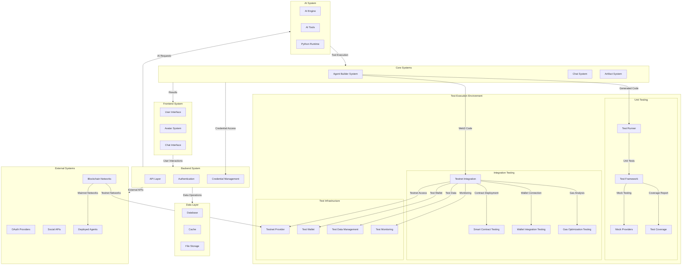
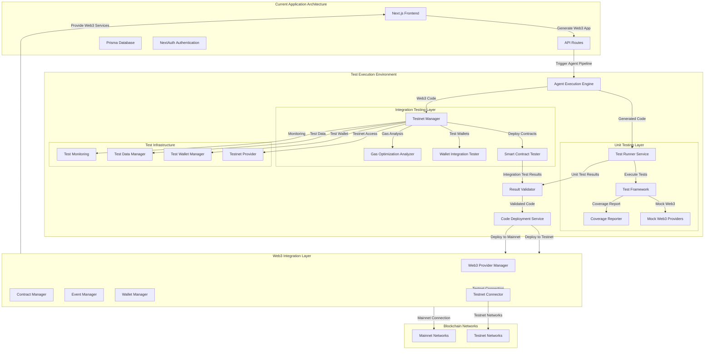
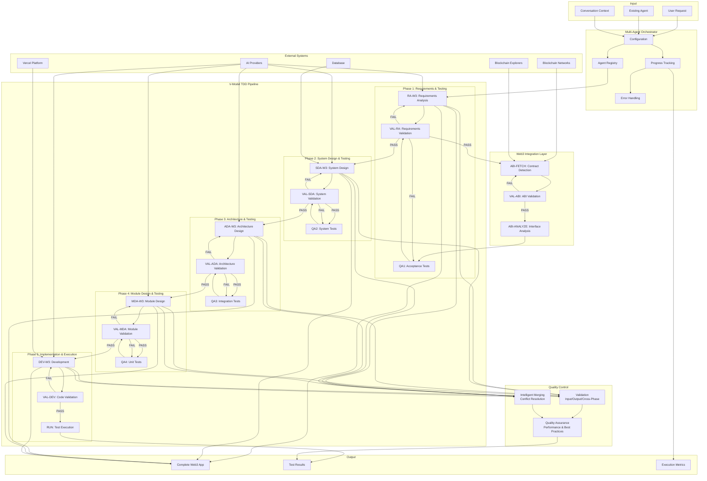
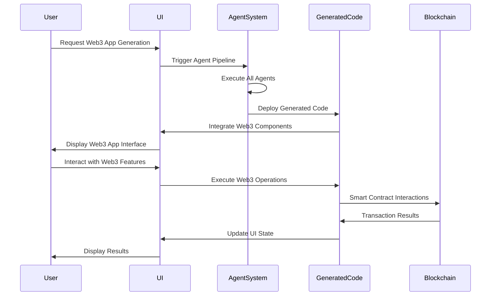
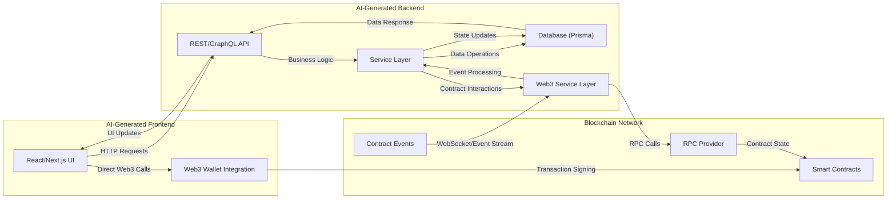
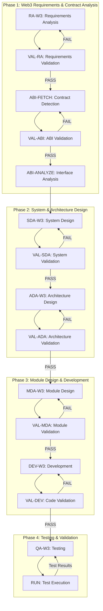
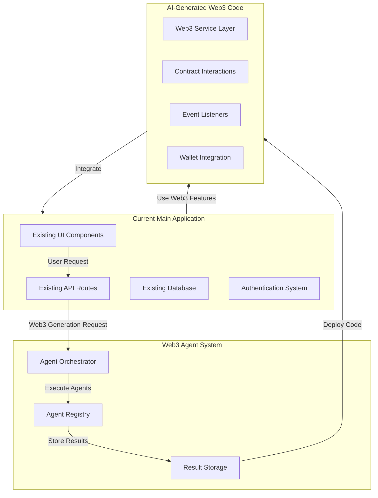

# Web3 Multi-Agent System Design for AI-Generated Applications


### High-level Design of Main App

The application is a sophisticated AI-powered chat and agent building platform built with Next.js 15, featuring a modular architecture with real-time capabilities and multi-modal interactions.



#### Core System Modules

**Frontend System:**
- User interface and navigation
- Avatar management and customization
- Chat interface with real-time messaging
- Multi-modal input/output support

**Backend System:**
- API layer and request handling
- Authentication and authorization
- Credential management and encryption
- External service integrations

**Agent Builder System:**
- V-Model TDD approach for agent generation
- Multi-phase development pipeline
- Quality metrics and testing
- Real-time progress tracking

**Chat System:**
- Conversational AI interface
- Message history and persistence
- Multi-modal interactions
- Real-time streaming responses

**Artifact System:**
- Code generation with Python runtime
- Image generation and processing
- Text and document processing
- Spreadsheet and data processing

**AI System:**
- AI model integration (OpenAI, xAI)
- Tool execution and function calling
- Python runtime for code execution
- Real-time streaming capabilities

**Data Layer:**
- Database management and persistence
- Caching and performance optimization
- File storage and management
- Session and state management

**Test Execution Environment:**
- **Unit Testing**: Test runner, framework, mock providers, and coverage reporting
- **Integration Testing**: Testnet integration, smart contract testing, wallet testing, and gas optimization
- **Test Infrastructure**: Testnet providers, test wallets, test data management, and monitoring

**External Systems:**
- OAuth provider integrations
- Social media API connections
- Deployed agent management
- Third-party service integrations
- Blockchain network integrations (testnet and mainnet)


---
### Test Execution Environment




---

### Agent Builder System



**Agent Builder Features:**
- **V-Model TDD Pipeline**: 5-phase multi-agent architecture with Test-Driven Development
- **Multi-Agent Orchestration**: Agent registry, progress tracking, error handling, and validation
- **Web3 Integration**: Smart contract ABI detection, analysis, and blockchain integration
- **Quality Control**: Multi-layer validation, intelligent merging, and quality assurance
- **External Integration**: AI providers, database, Vercel deployment, and blockchain networks
- **Real-time Progress**: Live updates with detailed metrics and test results


---

### UI Integration Flow:




---


### Data Flow of AI Generated App



### 2. Roles and Responsibilities of Each Agents

| Agent ID | Name | Role | Input | Output | Web3 Specific Responsibilities |
|----------|------|------|-------|--------|--------------------------------|
| **RA-W3** | Requirements Analysis Agent | Analyze user requirements for Web3 integration | User requirements text | `requirements_web3.json` | Identify blockchain networks, smart contracts, DeFi protocols, wallet requirements |
| **ABI-FETCH** | ABI Detection Agent | Fetch smart contract ABIs from blockchain explorers | `requirements_web3.json` | `abi_list.json` | Query Etherscan, PolygonScan, BSCScan APIs for contract ABIs |
| **ABI-ANALYZE** | ABI Analysis Agent | Analyze contract interfaces and interaction methods | `abi_list.json` | `contract_interaction_spec.json` | Map contract functions, events, and data structures |
| **SDA-W3** | System Design Agent | Design system architecture with Web3 integration | `contract_interaction_spec.json` | `system_design_web3.md` | Design Web3 service layer, event listeners, transaction handling |
| **ADA-W3** | Architecture Design Agent | Choose Web3-specific frameworks and providers | `system_design_web3.md` | `architecture_design_web3.md` | Select RPC providers, wallet libraries, blockchain networks |
| **MDA-W3** | Module Design Agent | Design Web3 interaction modules | `architecture_design_web3.md` | `module_design_web3.md` | Design contract interaction classes, wallet integration, event handlers |
| **DEV-W3** | Development Agent | Implement Web3 functionality | `module_design_web3.md` | `codebase/` | Write smart contract interactions, wallet connections, transaction handling |
| **QA-W3** | Testing Agent | Test Web3 functionality | `codebase/` | Test reports | Test contract interactions, transaction flows, event handling |
| **VAL-* ** | Validator Agents | Validate each phase output | Phase input + output | Validation reports | Ensure Web3 security, gas optimization, error handling |

### Interactions Between the Agents



---

### How Agents Accommodate Web3 Integration

#### Web3-Specific Agent Capabilities:

**RA-W3 (Requirements Analysis):**
- Identifies blockchain networks (Ethereum, Polygon, BSC, etc.)
- Recognizes DeFi protocols (Uniswap, Aave, Compound)
- Detects NFT standards (ERC-721, ERC-1155)
- Identifies wallet requirements (MetaMask, WalletConnect)

**ABI-FETCH & ABI-ANALYZE:**
- Queries multiple blockchain explorers (Etherscan, PolygonScan)
- Handles different contract standards and interfaces
- Maps complex DeFi protocol interactions
- Identifies event signatures and data structures

**SDA-W3 (System Design):**
- Designs Web3 service layer architecture
- Plans event listener implementations
- Defines transaction handling patterns
- Specifies gas optimization strategies

**ADA-W3 (Architecture Design):**
- Selects appropriate RPC providers (Alchemy, Infura, QuickNode)
- Chooses Web3 libraries (ethers.js, web3.js, viem)
- Defines wallet integration patterns
- Specifies blockchain network configurations

**MDA-W3 (Module Design):**
- Designs contract interaction classes
- Defines wallet connection modules
- Specifies event handling patterns
- Creates transaction management systems

**DEV-W3 (Development):**
- Implements smart contract interactions
- Creates wallet integration code
- Builds event listener systems
- Implements transaction signing and broadcasting


---

### Prompt Design for Each Agent

#### RA-W3 Prompt:
```
You are a Web3 requirements analysis expert. Analyze the following user requirements and extract Web3-specific needs:

Input: User requirements text
Output: requirements_web3.json

Include:
- Target blockchain networks
- Smart contract addresses and standards
- DeFi protocol integrations
- Wallet requirements
- Gas optimization needs
- Security considerations
```

#### ABI-FETCH Prompt:
```
You are a smart contract ABI detection specialist. Based on the requirements, identify and fetch relevant contract ABIs:

Input: requirements_web3.json
Output: abi_list.json

Tasks:
- Query blockchain explorers (Etherscan, PolygonScan, BSCScan)
- Fetch verified contract ABIs
- Handle multiple contract standards
- Validate contract addresses
```

#### SDA-W3 Prompt:
```
You are a Web3 system architect. Design a system architecture that integrates with blockchain networks:

Input: contract_interaction_spec.json
Output: system_design_web3.md

Design:
- Web3 service layer architecture
- Event listener patterns
- Transaction handling flows
- Error handling and retry mechanisms
- Gas optimization strategies
```

#### DEV-W3 Prompt:
```
You are a Web3 development expert. Implement the designed modules with blockchain integration:

Input: module_design_web3.md
Output: codebase/

Implement:
- Smart contract interaction classes
- Wallet connection modules
- Event listener systems
- Transaction management
- Error handling and logging
```

---

### Integration with Main App



---
