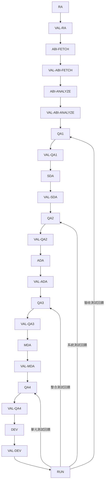
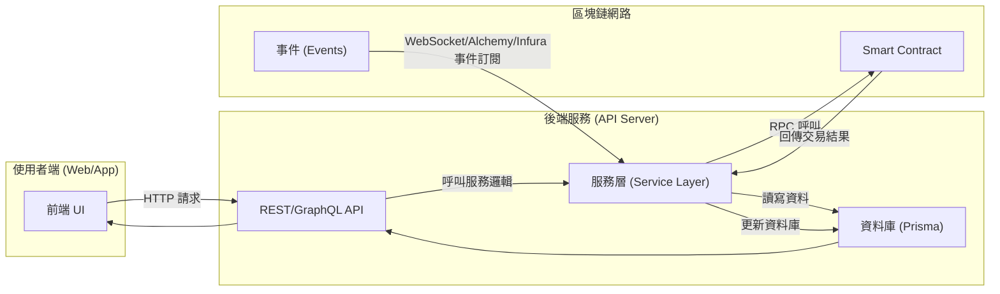
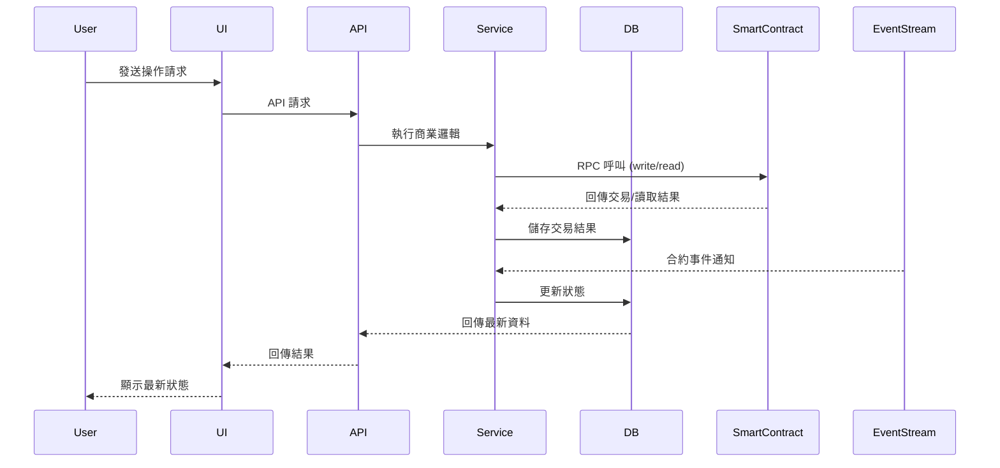
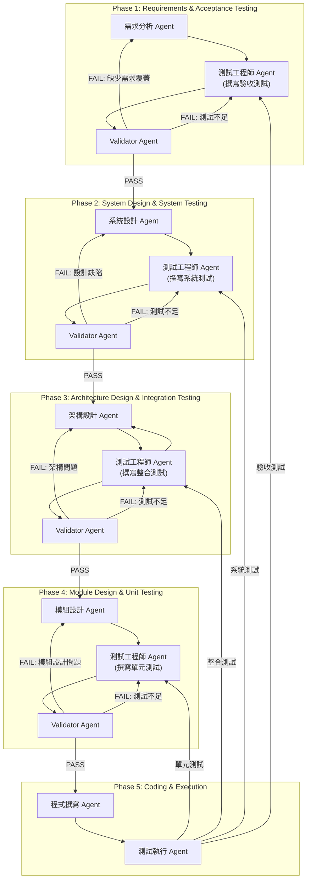

# Web3 自動開發 Multi-Agent 系統設計（含 Validator Agent 與 Prompt 設計）

## 1. AI Agent 與 Validator Agent 列表

| Agent ID  | 名稱 | 職責 | 輸入 | 輸出 |
|-----------|------|------|------|------|
| RA-W3     | **需求分析 Agent (Web3)** | 從使用者需求中判斷需互動的 smart contract、鏈別、功能需求、非功能需求 | 使用者需求文字 | `requirements_web3.json` |
| VAL-RA    | **需求驗證 Agent** | 驗證需求分析結果是否完整且準確 | 使用者需求文字 + `requirements_web3.json` | 驗證報告 |
| ABI-FETCH | **ABI 探測 Agent** | 根據需求找出對應的 smart contract 地址，並抓取其 ABI（從 Etherscan / API） | `requirements_web3.json` | `abi_list.json` |
| VAL-ABI-FETCH | **ABI 探測驗證 Agent** | 驗證 ABI 是否正確對應需求 | `abi_list.json` + `requirements_web3.json` | 驗證報告 |
| ABI-ANALYZE | **ABI 分析 Agent** | 分析 ABI 並建立互動方法列表（methods, inputs, outputs, events） | `abi_list.json` | `contract_interaction_spec.json` |
| VAL-ABI-ANALYZE | **ABI 分析驗證 Agent** | 驗證互動方法列表是否完整 | `contract_interaction_spec.json` + `abi_list.json` | 驗證報告 |
| QA1       | **驗收測試 Agent (Web3)** | 根據需求與合約規格撰寫 Gherkin 驗收測試 | `requirements_web3.json` + `contract_interaction_spec.json` | `acceptance_tests.feature` |
| VAL-QA1   | **驗收測試驗證 Agent** | 驗證驗收測試是否覆蓋所有需求與合約互動 | `acceptance_tests.feature` + `requirements_web3.json` | 驗證報告 |
| SDA-W3    | **系統設計 Agent (Web3)** | 設計與 smart contract 互動的系統架構，包括 Prisma schema、API endpoint、合約呼叫流程 | `acceptance_tests.feature` + `contract_interaction_spec.json` | `system_design_web3.md` |
| VAL-SDA   | **系統設計驗證 Agent** | 驗證系統設計是否能支援所有驗收測試 | `system_design_web3.md` + `acceptance_tests.feature` | 驗證報告 |
| QA2       | **系統測試 Agent** | 根據系統設計撰寫端到端系統測試 | `system_design_web3.md` | `system_tests.py` |
| VAL-QA2   | **系統測試驗證 Agent** | 驗證系統測試是否覆蓋系統設計 | `system_tests.py` + `system_design_web3.md` | 驗證報告 |
| ADA-W3    | **架構設計 Agent (Web3)** | 選擇框架、部署環境、資料儲存、RPC Provider、前端框架 | `system_tests.py` | `architecture_design_web3.md` |
| VAL-ADA   | **架構設計驗證 Agent** | 驗證架構設計是否符合系統需求與測試 | `architecture_design_web3.md` + `system_tests.py` | 驗證報告 |
| QA3       | **整合測試 Agent (Web3)** | 驗證 API 與 smart contract 互動正確性 | `architecture_design_web3.md` | `integration_tests.py` |
| VAL-QA3   | **整合測試驗證 Agent** | 驗證整合測試是否覆蓋架構互動點 | `integration_tests.py` + `architecture_design_web3.md` | 驗證報告 |
| MDA-W3    | **模組設計 Agent (Web3)** | 定義與合約互動的模組 Class/Methods、資料驗證邏輯、Prisma schema | `integration_tests.py` | `module_design_web3.md` |
| VAL-MDA   | **模組設計驗證 Agent** | 驗證模組設計是否能通過整合測試 | `module_design_web3.md` + `integration_tests.py` | 驗證報告 |
| QA4       | **單元測試 Agent (Web3)** | 覆蓋合約呼叫模組與資料處理邏輯的單元測試 | `module_design_web3.md` | `unit_tests.py` |
| VAL-QA4   | **單元測試驗證 Agent** | 驗證單元測試覆蓋率與準確性 | `unit_tests.py` + `module_design_web3.md` | 驗證報告 |
| DEV-W3    | **開發 Agent (Web3)** | 根據模組設計與單元測試，撰寫與 smart contract 互動的程式碼 | `module_design_web3.md` + `unit_tests.py` | `codebase/` |
| VAL-DEV   | **開發驗證 Agent** | 驗證程式碼是否通過所有測試並符合設計 | `codebase/` + `unit_tests.py` | 驗證報告 |
| RUN       | **測試執行 Agent** | 執行所有測試並產生報告 | `codebase/` | 測試結果報告 |

---

## 2. AI Agent 與 Validator Agent 執行互動流程



---

## 3. Prompt 設計（完整）

### RA-W3 Prompt
```
你是一個 Web3 需求分析專家，請將以下使用者需求轉換為結構化 JSON，包含：鏈別、合約名稱、功能需求、非功能需求。
輸入：使用者需求文字
輸出：requirements_web3.json
```

### VAL-RA Prompt
```
你是一個需求驗證專家，請比對原始使用者需求與 requirements_web3.json，確認是否完整、正確且無遺漏。
輸入：使用者需求 + requirements_web3.json
輸出：驗證報告
```

（其餘各 Agent 與 Validator Agent 依此模式設計 Prompt，確保輸入、輸出與檢核目標明確。）

---

## 4. 資料流圖與合約事件監聽流程






### Interactions
