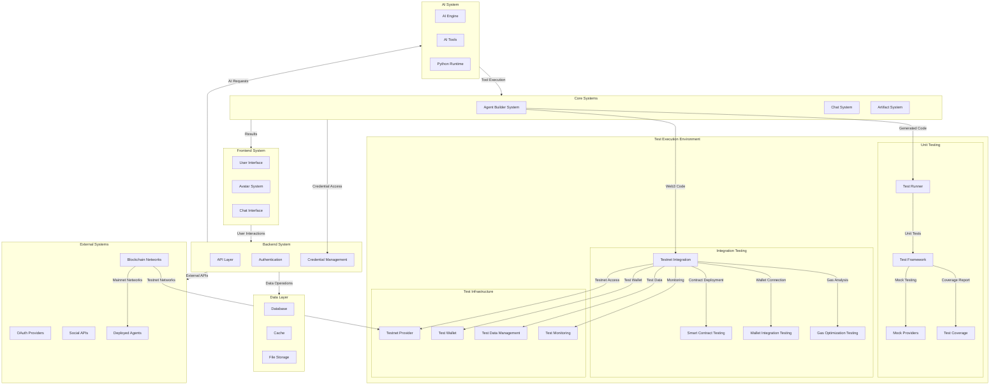
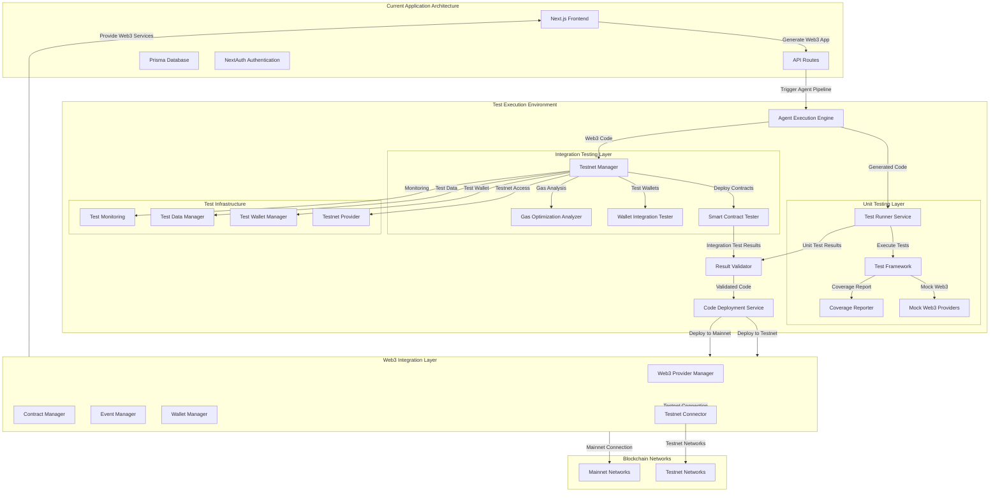
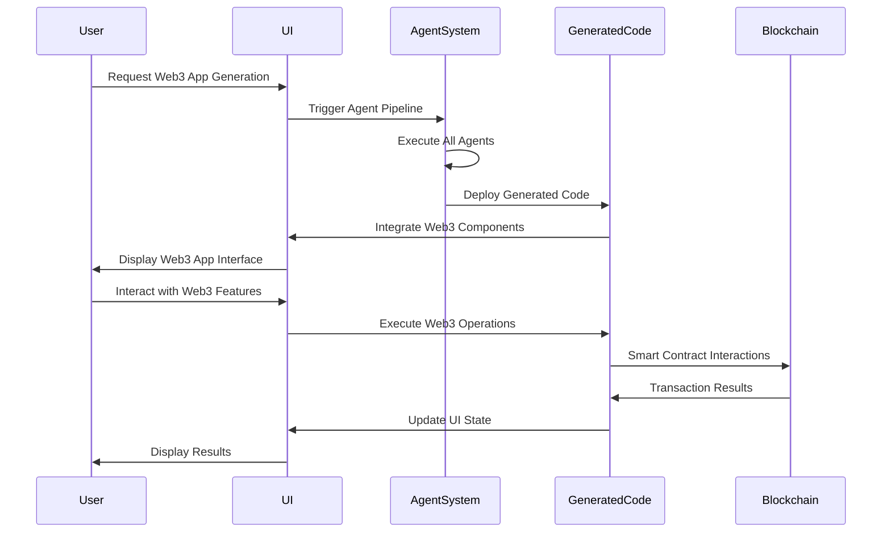
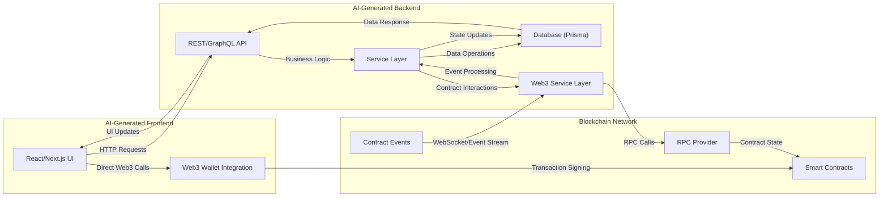
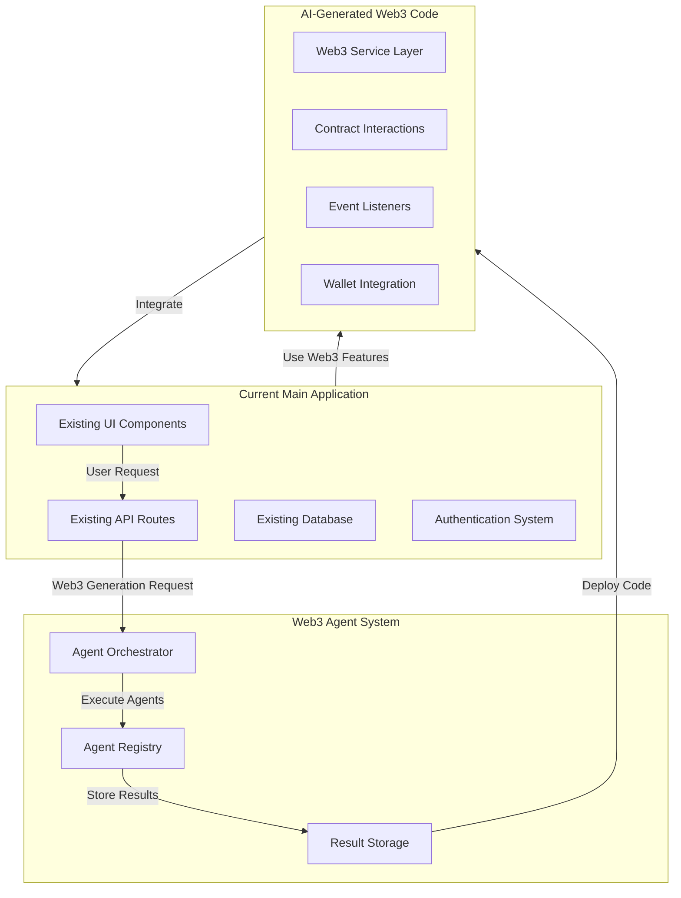
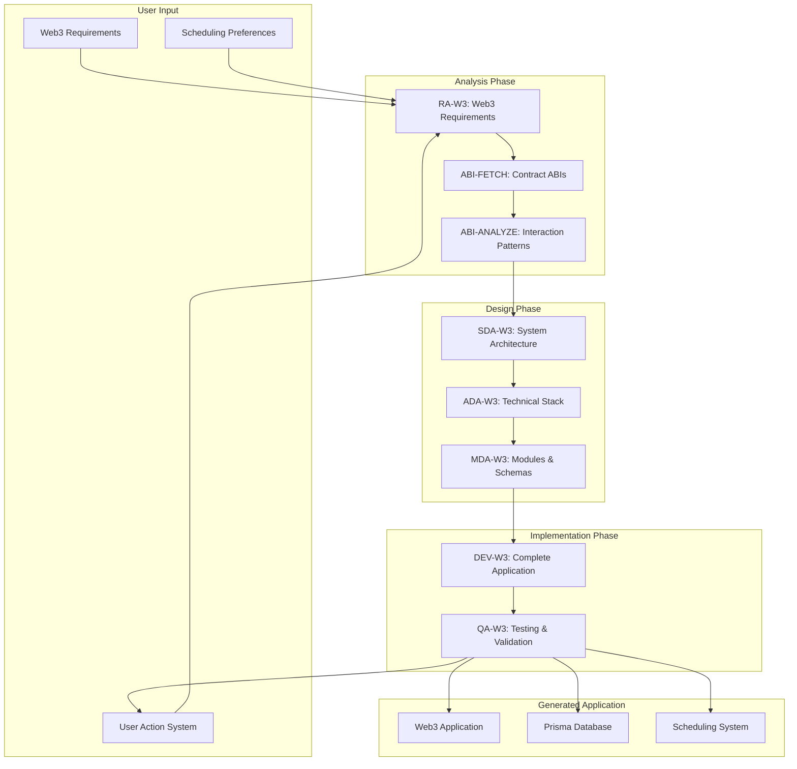
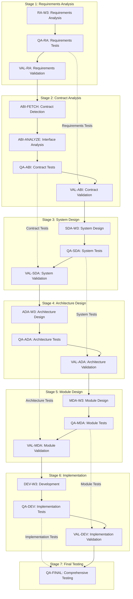
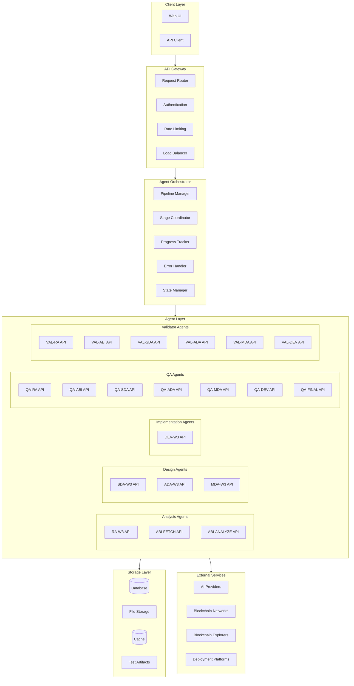

# Web3 Multi-Agent System Design for AI-Generated Applications


### High-level Design of Main App




---
### Test Execution Environment




---

### UI Integration Flow:




---


### Data Flow of AI Generated App




---

### Agent Builder System with V-Model Test-Driven Approach

```mermaid
flowchart TD
    subgraph Input["Input"]
        UserRequest[User Request<br/>Web3 Requirements]
        ExistingAgent[Existing Agent]
        Context[Conversation Context]
    end

    subgraph Orchestrator["Multi-Agent Orchestrator"]
        Config[Configuration]
        Progress[Progress Tracking]
        ErrorHandler[Error Handling]
        AgentRegistry[Agent Registry]
    end

    subgraph Stage1["Stage 1: Requirements Analysis"]
        subgraph Requirements["Requirements Analysis"]
            RA[RA-W3: Requirements Analysis<br/>• Parse Web3 functionality<br/>• Identify blockchain networks<br/>• Detect smart contracts<br/>• Extract business logic<br/>• Identify scheduling needs]
            QA_RA[QA-RA: Requirements Tests<br/>• Acceptance test scenarios<br/>• Business logic validation<br/>• Web3 requirement coverage<br/>• User story test cases]
            VAL_RA[VAL-RA: Requirements Validation<br/>• Validate against test scenarios<br/>• Verify blockchain selections<br/>• Check DeFi compatibility<br/>• Validate wallet requirements]
        end
    end

    subgraph Stage2["Stage 2: Contract Analysis"]
        subgraph ContractAnalysis["Contract Analysis"]
            ABI_FETCH[ABI-FETCH: Contract Detection<br/>• Query blockchain explorers<br/>• Fetch verified ABIs<br/>• Validate contract addresses<br/>• Handle proxy patterns]
            ABI_ANALYZE[ABI-ANALYZE: Interface Analysis<br/>• Map contract functions<br/>• Analyze gas costs<br/>• Identify events<br/>• Map dependencies]
            QA_ABI[QA-ABI: Contract Tests<br/>• ABI validation tests<br/>• Contract interaction tests<br/>• Gas cost analysis tests<br/>• Event handling tests]
            VAL_ABI[VAL-ABI: Contract Validation<br/>• Validate against contract tests<br/>• Verify ABI completeness<br/>• Check function signatures<br/>• Validate permissions]
        end
    end

    subgraph Stage3["Stage 3: System Design"]
        subgraph SystemDesign["System Design"]
            SDA[SDA-W3: System Design<br/>• Design Web3 service layer<br/>• Plan event listeners<br/>• Define transaction patterns<br/>• Design scheduling system]
            QA_SDA[QA-SDA: System Tests<br/>• System integration tests<br/>• Service layer tests<br/>• Event listener tests<br/>• Transaction flow tests]
            VAL_SDA[VAL-SDA: System Validation<br/>• Validate against system tests<br/>• Check service layer design<br/>• Verify event architecture<br/>• Validate security patterns]
        end
    end

    subgraph Stage4["Stage 4: Architecture Design"]
        subgraph ArchitectureDesign["Architecture Design"]
            ADA["ADA-W3: Architecture Design<br/>• Select RPC providers<br/>• Choose Web3 libraries<br/>• Define wallet patterns<br/>• Select database (Prisma)"]
            QA_ADA[QA-ADA: Architecture Tests<br/>• Framework compatibility tests<br/>• Provider integration tests<br/>• Database schema tests<br/>• Deployment configuration tests]
            VAL_ADA[VAL-ADA: Architecture Validation<br/>• Validate against architecture tests<br/>• Check library compatibility<br/>• Verify database choices<br/>• Validate deployment strategy]
        end
    end

    subgraph Stage5["Stage 5: Module Design"]
        subgraph ModuleDesign["Module Design"]
            MDA[MDA-W3: Module Design<br/>• Design Prisma schemas<br/>• Create contract classes<br/>• Define user actions<br/>• Design scheduling modules]
            QA_MDA[QA-MDA: Module Tests<br/>• Prisma schema tests<br/>• Contract class tests<br/>• User action tests<br/>• Scheduling module tests]
            VAL_MDA[VAL-MDA: Module Validation<br/>• Validate against module tests<br/>• Check contract modules<br/>• Verify action definitions<br/>• Validate API endpoints]
        end
    end

    subgraph Stage6["Stage 6: Implementation"]
        subgraph Development["Development"]
            DEV[DEV-W3: Development<br/>• Implement Prisma schemas<br/>• Write contract interactions<br/>• Create wallet integration<br/>• Build action engine<br/>• Implement scheduling]
            QA_DEV[QA-DEV: Implementation Tests<br/>• Unit tests for all modules<br/>• Integration tests<br/>• End-to-end tests<br/>• Performance tests]
            VAL_DEV[VAL-DEV: Implementation Validation<br/>• Validate against implementation tests<br/>• Check code quality<br/>• Verify Web3 security<br/>• Validate API implementations]
        end
    end

    subgraph Stage7["Stage 7: Final Testing"]
        subgraph FinalTesting["Final Testing"]
            QA_FINAL[QA-FINAL: Comprehensive Testing<br/>• Execute all stage tests<br/>• Cross-stage integration tests<br/>• User acceptance tests<br/>• Performance & security tests]
        end
    end

    subgraph Quality["Quality Control"]
        Validation[Validation<br/>Input/Output/Cross-Phase]
        Merging[Intelligent Merging<br/>Conflict Resolution]
        QualityCheck[Quality Assurance<br/>Performance & Best Practices]
    end

    subgraph Output["Output"]
        Web3App[Complete Web3 App<br/>• Prisma Database<br/>• User Action System<br/>• Scheduling System<br/>• Contract Integration]
        TestSuite[Complete Test Suite<br/>• Requirements Tests<br/>• Contract Tests<br/>• System Tests<br/>• Architecture Tests<br/>• Module Tests<br/>• Implementation Tests]
        Metrics[Execution Metrics<br/>• Performance Data<br/>• Gas Analysis<br/>• Error Rates<br/>• User Metrics]
    end

    subgraph External["External Systems"]
        AI[AI Providers]
        DB[Database Providers]
        Vercel[Vercel Platform]
        Blockchain[Blockchain Networks<br/>• Ethereum<br/>• Polygon<br/>• BSC]
        Explorers[Blockchain Explorers<br/>• Etherscan<br/>• PolygonScan<br/>• BSCScan]
    end

    %% Main Flow
    UserRequest --> Config
    ExistingAgent --> Config
    Context --> Config
    
    Config --> Progress
    Progress --> ErrorHandler
    Config --> AgentRegistry
    
    %% Stage 1: Requirements Analysis
    AgentRegistry --> RA
    RA --> QA_RA
    QA_RA --> VAL_RA
    VAL_RA -->|PASS| ABI_FETCH
    VAL_RA -->|FAIL| RA
    
    %% Stage 2: Contract Analysis
    ABI_FETCH --> ABI_ANALYZE
    ABI_ANALYZE --> QA_ABI
    QA_ABI --> VAL_ABI
    VAL_ABI -->|PASS| SDA
    VAL_ABI -->|FAIL| ABI_FETCH
    
    %% Stage 3: System Design
    SDA --> QA_SDA
    QA_SDA --> VAL_SDA
    VAL_SDA -->|PASS| ADA
    VAL_SDA -->|FAIL| SDA
    
    %% Stage 4: Architecture Design
    ADA --> QA_ADA
    QA_ADA --> VAL_ADA
    VAL_ADA -->|PASS| MDA
    VAL_ADA -->|FAIL| ADA
    
    %% Stage 5: Module Design
    MDA --> QA_MDA
    QA_MDA --> VAL_MDA
    VAL_MDA -->|PASS| DEV
    VAL_MDA -->|FAIL| MDA
    
    %% Stage 6: Implementation
    DEV --> QA_DEV
    QA_DEV --> VAL_DEV
    VAL_DEV -->|PASS| QA_FINAL
    VAL_DEV -->|FAIL| DEV
    
    %% Stage 7: Final Testing
    QA_FINAL -->|All Tests Pass| Web3App
    QA_FINAL -->|Tests Fail| VAL_DEV

    %% Test Flow Between Stages
    QA_RA -.->|Requirements Tests| VAL_ABI
    QA_ABI -.->|Contract Tests| VAL_SDA
    QA_SDA -.->|System Tests| VAL_ADA
    QA_ADA -.->|Architecture Tests| VAL_MDA
    QA_MDA -.->|Module Tests| VAL_DEV
    QA_DEV -.->|Implementation Tests| QA_FINAL

    %% Quality Integration
    RA --> Validation
    SDA --> Validation
    ADA --> Validation
    MDA --> Validation
    DEV --> Validation

    RA --> Merging
    SDA --> Merging
    ADA --> Merging
    MDA --> Merging
    DEV --> Merging

    Validation --> QualityCheck
    Merging --> QualityCheck

    %% Output Generation
    RA --> Web3App
    SDA --> Web3App
    ADA --> Web3App
    MDA --> Web3App
    DEV --> Web3App

    QA_RA --> TestSuite
    QA_ABI --> TestSuite
    QA_SDA --> TestSuite
    QA_ADA --> TestSuite
    QA_MDA --> TestSuite
    QA_DEV --> TestSuite
    QA_FINAL --> TestSuite

    QualityCheck --> TestSuite
    Progress --> Metrics

    %% External Integrations
    AI --> RA
    AI --> SDA
    AI --> ADA
    AI --> MDA
    AI --> DEV
    
    DB --> SDA
    DB --> MDA
    Vercel --> DEV
    Blockchain --> ABI_FETCH
    Explorers --> ABI_FETCH
```


---


### Detailed Agent Responsibilities for Web3 Application Generation

| Agent ID | Name | Role | Input (Source) | Responsibilities | Output |
|----------|------|------|----------------|------------------|---------|
| **RA-W3** | Requirements Analysis Agent | Analyze user requirements and identify Web3 integration needs | User requirements text (from chat interface) | • Parse user intent for Web3 functionality<br>• Identify target blockchain networks (Ethereum, Polygon, BSC, etc.)<br>• Detect smart contract requirements and addresses<br>• Recognize DeFi protocols (Uniswap, Aave, Compound, etc.)<br>• Identify NFT standards (ERC-721, ERC-1155)<br>• Determine wallet integration requirements<br>• Extract business logic requirements<br>• Identify data storage needs (on-chain vs off-chain)<br>• Detect scheduling requirements for automated actions | `requirements_web3.json` with structured Web3 requirements |
| **ABI-FETCH** | ABI Detection Agent | Fetch and validate smart contract ABIs from blockchain explorers | `requirements_web3.json` (from RA-W3) | • Query multiple blockchain explorers (Etherscan, PolygonScan, BSCScan)<br>• Fetch verified contract ABIs for identified addresses<br>• Handle different contract standards and interfaces<br>• Validate contract addresses and deployment status<br>• Detect contract versioning and proxy patterns<br>• Identify related contracts (factories, routers, etc.)<br>• Extract contract metadata and documentation<br>• Handle unverified contracts with fallback strategies | `abi_list.json` with complete contract interface definitions |
| **ABI-ANALYZE** | ABI Analysis Agent | Analyze contract interfaces and map interaction patterns | `abi_list.json` (from ABI-FETCH) | • Map contract functions, events, and data structures<br>• Identify read vs write operations<br>• Analyze gas costs for different operations<br>• Map complex DeFi protocol interactions<br>• Identify event signatures and data structures<br>• Detect permission and access control patterns<br>• Map cross-contract dependencies<br>• Identify common interaction patterns<br>• Analyze error handling and revert conditions | `contract_interaction_spec.json` with detailed interaction specifications |
| **SDA-W3** | System Design Agent | Design comprehensive system architecture with Web3 integration | `contract_interaction_spec.json` (from ABI-ANALYZE) | • Design Web3 service layer architecture<br>• Plan event listener implementations<br>• Define transaction handling patterns<br>• Specify gas optimization strategies<br>• Design data flow between on-chain and off-chain<br>• Plan user action workflows<br>• Define scheduling system architecture<br>• Design error handling and retry mechanisms<br>• Plan monitoring and logging systems<br>• Design security patterns and access controls | `system_design_web3.md` with complete system architecture |
| **ADA-W3** | Architecture Design Agent | Choose Web3-specific frameworks, providers, and technical stack | `system_design_web3.md` (from SDA-W3) | • Select appropriate RPC providers (Alchemy, Infura, QuickNode)<br>• Choose Web3 libraries (ethers.js, web3.js, viem)<br>• Define wallet integration patterns (MetaMask, WalletConnect)<br>• Specify blockchain network configurations<br>• Choose database technology (Prisma with PostgreSQL/MySQL)<br>• Select frontend framework (Next.js, React)<br>• Choose backend framework and API patterns<br>• Define deployment and hosting strategy<br>• Select monitoring and analytics tools<br>• Choose testing frameworks for Web3 | `architecture_design_web3.md` with technical stack decisions |
| **MDA-W3** | Module Design Agent | Design detailed Web3 interaction modules and data schemas | `architecture_design_web3.md` (from ADA-W3) | • Design Prisma data schemas for off-chain data<br>• Create contract interaction classes<br>• Define wallet connection modules<br>• Design event handling patterns<br>• Create transaction management systems<br>• Design user action definitions<br>• Create scheduling system modules<br>• Define API endpoint structures<br>• Design UI component specifications<br>• Create error handling modules<br>• Design monitoring and logging modules | `module_design_web3.md` with detailed module specifications |
| **DEV-W3** | Development Agent | Implement complete Web3 application with all modules | `module_design_web3.md` (from MDA-W3) | • Implement Prisma database schemas and migrations<br>• Write smart contract interaction classes<br>• Create wallet integration code<br>• Build event listener systems<br>• Implement transaction signing and broadcasting<br>• Create user action execution engine<br>• Build scheduling system for automated actions<br>• Implement API endpoints for all actions<br>• Create frontend components and pages<br>• Implement error handling and logging<br>• Create monitoring and analytics integration<br>• Build testing suites for all components | Complete `codebase/` with deployable application |
| **QA-RA** | Requirements Testing Agent | Create acceptance tests and validation scenarios for requirements | `requirements_web3.json` (from RA-W3) | • Create acceptance test scenarios<br>• Design business logic validation tests<br>• Develop Web3 requirement coverage tests<br>• Write user story test cases<br>• Define success criteria for requirements<br>• Create test data for requirements validation<br>• Design requirement traceability tests | `requirements_tests.json` with comprehensive test scenarios |
| **QA-ABI** | Contract Testing Agent | Create tests for contract analysis and ABI validation | `abi_list.json` + `contract_interaction_spec.json` (from ABI-FETCH + ABI-ANALYZE) | • Create ABI validation tests<br>• Design contract interaction test scenarios<br>• Develop gas cost analysis tests<br>• Write event handling test cases<br>• Create contract function validation tests<br>• Design cross-contract dependency tests<br>• Develop permission and access control tests | `contract_tests.json` with contract validation test suite |
| **QA-SDA** | System Testing Agent | Create system integration and architecture tests | `system_design_web3.md` (from SDA-W3) | • Design system integration tests<br>• Create service layer test scenarios<br>• Develop event listener test cases<br>• Write transaction flow tests<br>• Create scheduling system tests<br>• Design error handling test scenarios<br>• Develop security pattern tests | `system_tests.json` with system validation test suite |
| **QA-ADA** | Architecture Testing Agent | Create framework and technology stack tests | `architecture_design_web3.md` (from ADA-W3) | • Design framework compatibility tests<br>• Create provider integration test scenarios<br>• Develop database schema tests<br>• Write deployment configuration tests<br>• Create library compatibility tests<br>• Design performance benchmark tests<br>• Develop scalability tests | `architecture_tests.json` with architecture validation test suite |
| **QA-MDA** | Module Testing Agent | Create module and component tests | `module_design_web3.md` (from MDA-W3) | • Design Prisma schema tests<br>• Create contract class test scenarios<br>• Develop user action test cases<br>• Write scheduling module tests<br>• Create API endpoint test scenarios<br>• Design UI component tests<br>• Develop error handling module tests | `module_tests.json` with module validation test suite |
| **QA-DEV** | Implementation Testing Agent | Create comprehensive implementation tests | `codebase/` (from DEV-W3) | • Create unit tests for all modules<br>• Design integration test scenarios<br>• Develop end-to-end test cases<br>• Write performance tests<br>• Create security tests<br>• Design database operation tests<br>• Develop API endpoint tests | `implementation_tests.json` with comprehensive test suite |
| **QA-FINAL** | Final Testing Agent | Execute all tests and provide comprehensive validation | All test suites + `codebase/` | • Execute all stage-specific tests<br>• Run cross-stage integration tests<br>• Perform user acceptance tests<br>• Execute performance and security tests<br>• Validate complete application functionality<br>• Generate comprehensive test reports<br>• Provide deployment readiness assessment | Final test report with deployment recommendations |
| **VAL-RA** | Requirements Validator | Validate requirements against acceptance tests | RA-W3 output + QA-RA tests + User input | • Execute requirements acceptance tests<br>• Validate against business logic tests<br>• Verify Web3 requirement coverage<br>• Check user story test cases<br>• Validate blockchain network selections<br>• Verify contract address validity<br>• Check DeFi protocol compatibility<br>• Validate wallet requirements | Requirements validation report with test results |
| **VAL-ABI** | Contract Validator | Validate contract analysis against contract tests | ABI-FETCH + ABI-ANALYZE outputs + QA-ABI tests | • Execute ABI validation tests<br>• Run contract interaction tests<br>• Validate gas cost analysis tests<br>• Check event handling test cases<br>• Verify contract function validation<br>• Validate cross-contract dependencies<br>• Check permission and access control tests | Contract validation report with test results |
| **VAL-SDA** | System Design Validator | Validate system design against system tests | SDA-W3 output + QA-SDA tests | • Execute system integration tests<br>• Validate service layer test scenarios<br>• Check event listener test cases<br>• Verify transaction flow tests<br>• Validate scheduling system tests<br>• Check error handling scenarios<br>• Validate security pattern tests | System design validation report with test results |
| **VAL-ADA** | Architecture Validator | Validate architecture against architecture tests | ADA-W3 output + QA-ADA tests | • Execute framework compatibility tests<br>• Validate provider integration tests<br>• Check database schema tests<br>• Verify deployment configuration tests<br>• Validate library compatibility tests<br>• Check performance benchmark tests<br>• Validate scalability tests | Architecture validation report with test results |
| **VAL-MDA** | Module Design Validator | Validate module design against module tests | MDA-W3 output + QA-MDA tests | • Execute Prisma schema tests<br>• Validate contract class test scenarios<br>• Check user action test cases<br>• Verify scheduling module tests<br>• Validate API endpoint test scenarios<br>• Check UI component tests<br>• Validate error handling module tests | Module design validation report with test results |
| **VAL-DEV** | Development Validator | Validate implementation against implementation tests | DEV-W3 output + QA-DEV tests | • Execute unit tests for all modules<br>• Validate integration test scenarios<br>• Check end-to-end test cases<br>• Verify performance tests<br>• Validate security tests<br>• Check database operation tests<br>• Validate API endpoint tests | Development validation report with test results |


---

### How Agents Accommodate Web3 Integration

#### Web3-Specific Agent Capabilities:

**RA-W3 (Requirements Analysis):**
- Identifies blockchain networks (Ethereum, Polygon, BSC, etc.)
- Recognizes DeFi protocols (Uniswap, Aave, Compound)
- Detects NFT standards (ERC-721, ERC-1155)
- Identifies wallet requirements (MetaMask, WalletConnect)

**ABI-FETCH & ABI-ANALYZE:**
- Queries multiple blockchain explorers (Etherscan, PolygonScan)
- Handles different contract standards and interfaces
- Maps complex DeFi protocol interactions
- Identifies event signatures and data structures

**SDA-W3 (System Design):**
- Designs Web3 service layer architecture
- Plans event listener implementations
- Defines transaction handling patterns
- Specifies gas optimization strategies

**ADA-W3 (Architecture Design):**
- Selects appropriate RPC providers (Alchemy, Infura, QuickNode)
- Chooses Web3 libraries (ethers.js, web3.js, viem)
- Defines wallet integration patterns
- Specifies blockchain network configurations

**MDA-W3 (Module Design):**
- Designs contract interaction classes
- Defines wallet connection modules
- Specifies event handling patterns
- Creates transaction management systems

**DEV-W3 (Development):**
- Implements smart contract interactions
- Creates wallet integration code
- Builds event listener systems
- Implements transaction signing and broadcasting


---

### Prompt Design for Each Agent

#### RA-W3 Prompt:
```
You are a Web3 requirements analysis expert. Analyze the following user requirements and extract Web3-specific needs:

Input: User requirements text
Output: requirements_web3.json

Include:
- Target blockchain networks
- Smart contract addresses and standards
- DeFi protocol integrations
- Wallet requirements
- Gas optimization needs
- Security considerations
```

#### ABI-FETCH Prompt:
```
You are a smart contract ABI detection specialist. Based on the requirements, identify and fetch relevant contract ABIs:

Input: requirements_web3.json
Output: abi_list.json

Tasks:
- Query blockchain explorers (Etherscan, PolygonScan, BSCScan)
- Fetch verified contract ABIs
- Handle multiple contract standards
- Validate contract addresses
```

#### SDA-W3 Prompt:
```
You are a Web3 system architect. Design a system architecture that integrates with blockchain networks:

Input: contract_interaction_spec.json
Output: system_design_web3.md

Design:
- Web3 service layer architecture
- Event listener patterns
- Transaction handling flows
- Error handling and retry mechanisms
- Gas optimization strategies
```

#### DEV-W3 Prompt:
```
You are a Web3 development expert. Implement the designed modules with blockchain integration:

Input: module_design_web3.md
Output: codebase/

Implement:
- Smart contract interaction classes
- Wallet connection modules
- Event listener systems
- Transaction management
- Error handling and logging
```

---

### Integration with Main App



---

### Agent Alignment with Web3 Application Characteristics

The agent system is specifically designed to handle the five core characteristics of our generated Web3 applications:

#### 1. **All Requests Related to Web3 Applications**
- **RA-W3**: Filters and validates that user requests contain Web3-specific requirements
- **ABI-FETCH**: Ensures all identified contracts are Web3-compatible and accessible
- **ABI-ANALYZE**: Maps Web3-specific interaction patterns and protocols
- **SDA-W3**: Designs architecture specifically for Web3 integration patterns
- **ADA-W3**: Selects Web3-native frameworks and providers
- **MDA-W3**: Creates Web3-specific modules and data structures
- **DEV-W3**: Implements Web3 functionality throughout the application

#### 2. **ABI Analysis for Smart Contract Integration**
- **ABI-FETCH**: Fetches complete ABIs from multiple blockchain explorers
- **ABI-ANALYZE**: Deep analysis of contract interfaces, functions, and events
- **SDA-W3**: Designs systems that leverage ABI information for interactions
- **MDA-W3**: Creates modules that use ABI data for contract interactions
- **DEV-W3**: Implements ABI-driven contract interaction code
- **QA-W3**: Tests ABI-based contract interactions and validates function calls

#### 3. **Prisma Data Schema Planning**
- **RA-W3**: Identifies data storage requirements (on-chain vs off-chain)
- **SDA-W3**: Plans data flow between blockchain and traditional databases
- **ADA-W3**: Selects Prisma as the primary ORM with appropriate database
- **MDA-W3**: Designs comprehensive Prisma schemas for:
  - User profiles and preferences
  - Transaction history and status
  - Scheduled actions and automation
  - Contract interaction logs
  - Event processing queues
  - Analytics and monitoring data
- **DEV-W3**: Implements Prisma schemas, migrations, and database operations
- **QA-W3**: Tests database operations and data consistency

#### 4. **Full-Set of User Actions Based on Analyzed Results**
- **RA-W3**: Extracts user intent and desired actions from requirements
- **ABI-ANALYZE**: Maps available contract functions to potential user actions
- **SDA-W3**: Designs action workflows and user interaction patterns
- **MDA-W3**: Defines complete action specifications including:
  - Contract interaction actions (read/write operations)
  - Wallet management actions (connect, disconnect, switch networks)
  - Transaction management actions (sign, broadcast, monitor)
  - Data management actions (store, retrieve, sync)
  - Automation actions (scheduled operations)
- **DEV-W3**: Implements action execution engine and API endpoints
- **QA-W3**: Tests all user actions and validates execution flows

#### 5. **User-Defined Action Scheduling**
- **RA-W3**: Identifies scheduling requirements in user requests
- **SDA-W3**: Designs scheduling system architecture
- **ADA-W3**: Selects appropriate scheduling frameworks and tools
- **MDA-W3**: Creates scheduling modules for:
  - Action scheduling interface
  - Cron job management
  - Recurring transaction patterns
  - Event-triggered actions
  - Time-based automation
- **DEV-W3**: Implements scheduling system with user interface
- **QA-W3**: Tests scheduling functionality and automation flows

### Cross-Agent Collaboration for Web3 Characteristics

| Characteristic | Primary Agents | Supporting Agents | Validation Agents |
|----------------|----------------|-------------------|-------------------|
| **Web3-Focused Requests** | RA-W3, ABI-FETCH | All Design Agents | VAL-RA, VAL-ABI |
| **ABI Analysis** | ABI-FETCH, ABI-ANALYZE | SDA-W3, MDA-W3 | VAL-ABI, VAL-SDA |
| **Prisma Schemas** | MDA-W3, DEV-W3 | SDA-W3, ADA-W3 | VAL-MDA, VAL-DEV |
| **User Actions** | MDA-W3, DEV-W3 | RA-W3, ABI-ANALYZE | VAL-MDA, VAL-DEV |
| **Action Scheduling** | MDA-W3, DEV-W3 | SDA-W3, ADA-W3 | VAL-MDA, VAL-DEV |

### Data Flow Between Agents for Web3 Characteristics



---

### V-Model Test-Driven Approach

The agent system implements a true V-Model approach where each stage produces tests that become validation criteria for the next stage. This ensures complete traceability and quality assurance throughout the development pipeline.

#### Test Flow Between Stages



#### How Tests Drive Validation

**Stage 1 → Stage 2: Requirements Tests → Contract Validation**
- QA-RA creates acceptance tests based on user requirements
- VAL-ABI uses these tests to validate that contract analysis meets user needs
- Ensures contract selection aligns with business requirements

**Stage 2 → Stage 3: Contract Tests → System Validation**
- QA-ABI creates tests for contract interactions and gas analysis
- VAL-SDA uses these tests to validate system design can handle contract requirements
- Ensures system architecture supports all contract operations

**Stage 3 → Stage 4: System Tests → Architecture Validation**
- QA-SDA creates integration and service layer tests
- VAL-ADA uses these tests to validate technology stack choices
- Ensures selected frameworks can implement system design

**Stage 4 → Stage 5: Architecture Tests → Module Validation**
- QA-ADA creates framework compatibility and performance tests
- VAL-MDA uses these tests to validate module design
- Ensures modules work with chosen architecture

**Stage 5 → Stage 6: Module Tests → Implementation Validation**
- QA-MDA creates component and API endpoint tests
- VAL-DEV uses these tests to validate code implementation
- Ensures implementation matches module specifications

**Stage 6 → Stage 7: Implementation Tests → Final Validation**
- QA-DEV creates comprehensive unit and integration tests
- QA-FINAL executes all tests to validate complete application
- Ensures final application meets all requirements

#### Benefits of This Approach

1. **Complete Traceability**: Every requirement is traced through tests to final implementation
2. **Early Defect Detection**: Issues are caught at the earliest possible stage
3. **Quality Assurance**: Each stage is validated against specific test criteria
4. **Risk Mitigation**: Technical and business risks are identified early
5. **Consistency**: Ensures each stage builds upon validated foundations
6. **Documentation**: Tests serve as living documentation of requirements and design

#### Test Artifacts Produced

| Stage | Test Artifact | Purpose | Used By |
|-------|---------------|---------|---------|
| **Stage 1** | `requirements_tests.json` | Validate business requirements | VAL-ABI |
| **Stage 2** | `contract_tests.json` | Validate contract analysis | VAL-SDA |
| **Stage 3** | `system_tests.json` | Validate system design | VAL-ADA |
| **Stage 4** | `architecture_tests.json` | Validate architecture choices | VAL-MDA |
| **Stage 5** | `module_tests.json` | Validate module design | VAL-DEV |
| **Stage 6** | `implementation_tests.json` | Validate code implementation | QA-FINAL |
| **Stage 7** | `final_test_report.json` | Comprehensive validation | Deployment |

---

## Agent System Implementation Design

### High-Level Architecture




---

# Implementation Strategy

### **API-First Architecture**

**Each Agent as a Microservice:**
```typescript
// Example agent API structure
interface AgentAPI {
  endpoint: string;
  method: 'POST';
  input: AgentInput;
  output: AgentOutput;
  status: 'idle' | 'processing' | 'completed' | 'failed';
}

// Example: RA-W3 Agent API
POST /api/agents/ra-w3
{
  "input": {
    "userRequirements": string;
    "context": object;
    "previousStageResults": object;
  },
  "output": {
    "requirements": object;
    "metadata": object;
    "validation": object;
  }
}
```

**Agent API Endpoints:**
```
/api/agents/ra-w3          # Requirements Analysis
/api/agents/abi-fetch      # Contract Detection
/api/agents/abi-analyze    # Interface Analysis
/api/agents/sda-w3         # System Design
/api/agents/ada-w3         # Architecture Design
/api/agents/mda-w3         # Module Design
/api/agents/dev-w3         # Development
/api/agents/qa-*           # All QA Agents
/api/agents/val-*          # All Validator Agents
```

### **Agent Orchestrator Design**

```typescript
interface Orchestrator {
  // Pipeline Management
  createPipeline(userRequest: UserRequest): Pipeline;
  executeStage(pipelineId: string, stage: Stage): Promise<StageResult>;
  validateStage(pipelineId: string, stage: Stage): Promise<ValidationResult>;
  
  // State Management
  getPipelineStatus(pipelineId: string): PipelineStatus;
  updatePipelineState(pipelineId: string, state: PipelineState): void;
  
  // Error Handling
  handleStageError(pipelineId: string, stage: Stage, error: Error): void;
  retryStage(pipelineId: string, stage: Stage): Promise<StageResult>;
}

interface Pipeline {
  id: string;
  stages: Stage[];
  currentStage: number;
  status: 'pending' | 'running' | 'completed' | 'failed';
  results: Map<Stage, StageResult>;
  tests: Map<Stage, TestArtifact>;
}
```

### **Agent Implementation Patterns**

**Base Agent Class:**
```typescript
abstract class BaseAgent {
  protected abstract process(input: AgentInput): Promise<AgentOutput>;
  protected abstract validate(input: AgentInput): Promise<ValidationResult>;
  
  async execute(input: AgentInput): Promise<AgentOutput> {
    // 1. Validate input
    const validation = await this.validate(input);
    if (!validation.isValid) {
      throw new AgentValidationError(validation.errors);
    }
    
    // 2. Process request
    const output = await this.process(input);
    
    // 3. Store results
    await this.storeResults(input, output);
    
    return output;
  }
  
  protected async storeResults(input: AgentInput, output: AgentOutput): Promise<void> {
    // Store in database and file storage
  }
}

// Example: RA-W3 Implementation
class RAW3Agent extends BaseAgent {
  protected async process(input: RAW3Input): Promise<RAW3Output> {
    // 1. Parse user requirements
    const requirements = await this.parseRequirements(input.userRequirements);
    
    // 2. Identify Web3 components
    const web3Components = await this.identifyWeb3Components(requirements);
    
    // 3. Extract business logic
    const businessLogic = await this.extractBusinessLogic(requirements);
    
    // 4. Generate structured output
    return {
      requirements: web3Components,
      businessLogic,
      metadata: this.generateMetadata(input),
      validation: await this.generateValidation(web3Components)
    };
  }
  
  protected async validate(input: RAW3Input): Promise<ValidationResult> {
    // Validate input format and completeness
  }
}
```

### **Test-Driven Agent Implementation**

**QA Agent Pattern:**
```typescript
abstract class BaseQAAgent extends BaseAgent {
  protected abstract generateTests(input: AgentInput): Promise<TestSuite>;
  protected abstract executeTests(tests: TestSuite, target: any): Promise<TestResults>;
  
  async execute(input: QAAgentInput): Promise<QAAgentOutput> {
    // 1. Generate tests based on input
    const testSuite = await this.generateTests(input);
    
    // 2. Execute tests against target
    const testResults = await this.executeTests(testSuite, input.target);
    
    // 3. Store test artifacts
    await this.storeTestArtifacts(testSuite, testResults);
    
    return {
      testSuite,
      testResults,
      recommendations: this.generateRecommendations(testResults)
    };
  }
}

// Example: QA-RA Implementation
class QARAAgent extends BaseQAAgent {
  protected async generateTests(input: QARAAgentInput): Promise<TestSuite> {
    const tests = [];
    
    // Generate acceptance test scenarios
    tests.push(...await this.generateAcceptanceTests(input.requirements));
    
    // Generate business logic validation tests
    tests.push(...await this.generateBusinessLogicTests(input.businessLogic));
    
    // Generate Web3 requirement coverage tests
    tests.push(...await this.generateWeb3CoverageTests(input.requirements));
    
    return {
      id: `qa-ra-${Date.now()}`,
      tests,
      metadata: this.generateTestMetadata(input)
    };
  }
}
```

### **Validator Agent Implementation**

**Validator Agent Pattern:**
```typescript
abstract class BaseValidatorAgent extends BaseAgent {
  protected abstract validateAgainstTests(input: ValidatorInput, tests: TestSuite): Promise<ValidationResult>;
  
  async execute(input: ValidatorInput): Promise<ValidatorOutput> {
    // 1. Load tests from previous stage
    const previousStageTests = await this.loadPreviousStageTests(input.pipelineId, input.previousStage);
    
    // 2. Validate current stage against tests
    const validationResult = await this.validateAgainstTests(input, previousStageTests);
    
    // 3. Generate validation report
    const validationReport = await this.generateValidationReport(validationResult);
    
    return {
      isValid: validationResult.isValid,
      validationReport,
      recommendations: validationResult.recommendations,
      nextStage: validationResult.isValid ? input.nextStage : null
    };
  }
}

// Example: VAL-ABI Implementation
class VALABIAgent extends BaseValidatorAgent {
  protected async validateAgainstTests(input: VALABIInput, tests: TestSuite): Promise<ValidationResult> {
    const results = [];
    
    // Execute requirements tests against contract analysis
    for (const test of tests.tests) {
      const result = await this.executeTest(test, input.contractAnalysis);
      results.push(result);
    }
    
    // Analyze results
    const isValid = results.every(r => r.passed);
    const recommendations = this.generateRecommendations(results);
    
    return {
      isValid,
      results,
      recommendations,
      coverage: this.calculateCoverage(results)
    };
  }
}
```

### **Implementation Phases**

**Phase 1: Core Infrastructure (Week 1-2)**
- Set up API gateway and orchestrator
- Implement base agent classes
- Set up database and storage
- Create basic pipeline management

**Phase 2: Analysis Agents (Week 3-4)**
- Implement RA-W3, ABI-FETCH, ABI-ANALYZE
- Implement QA-RA, QA-ABI
- Implement VAL-RA, VAL-ABI
- Test analysis pipeline

**Phase 3: Design Agents (Week 5-6)**
- Implement SDA-W3, ADA-W3, MDA-W3
- Implement QA-SDA, QA-ADA, QA-MDA
- Implement VAL-SDA, VAL-ADA, VAL-MDA
- Test design pipeline

**Phase 4: Implementation Agents (Week 7-8)**
- Implement DEV-W3
- Implement QA-DEV, QA-FINAL
- Implement VAL-DEV
- Test complete pipeline

**Phase 5: Integration & Testing (Week 9-10)**
- End-to-end testing
- Performance optimization
- Security hardening
- Documentation

