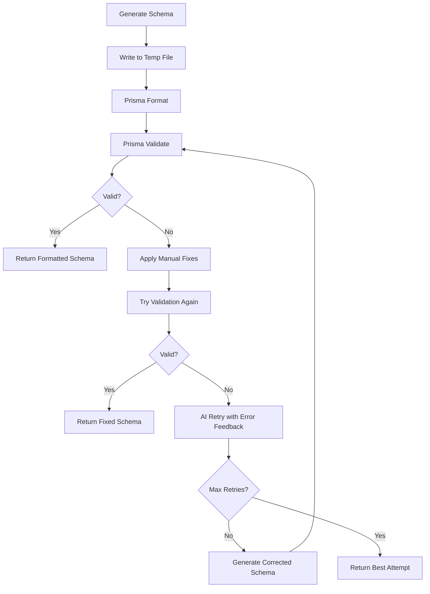

# Prisma Schema Validation & Formatting Integration

This document explains how the schema generation process now integrates with Prisma CLI for automatic validation and formatting.

## Overview

The schema generation process now includes:
1. **Programmatic Validation**: Uses comprehensive manual validation for schema correctness
2. **Automatic Error Fixing**: Manual fixes for common relation errors
3. **Retry Logic**: AI-powered retry with error feedback
4. **Robust Error Detection**: Multiple validation layers for comprehensive error catching

## How It Works

### 1. Initial Schema Generation
```typescript
const schema = await generatePrismaSchema({ step0Analysis });
```

### 2. Automatic Validation & Fixing
The generated schema goes through:
1. **Manual Relation Fixes**: Automatically fixes common relation errors
2. **Comprehensive Validation**: Checks syntax, structure, and relation correctness
3. **Additional Fixes**: Applies targeted fixes based on validation errors

### 3. Error Handling & Fixes
If validation fails, the system:
1. Applies manual relation fixes
2. Retries validation with fixed schema
3. Uses AI retry with error feedback if needed

## Common Relation Errors Fixed

### 1. Missing @relation fields
**Error**: "The relation field `lead` on Model `CRMRecord` must specify the `fields` argument"

**Fix**: Automatically adds `fields` and `references` arguments:
```prisma
// Before (error)
model CRMRecord {
  leadId String?
  lead   Lead? @relation
}

// After (fixed)
model CRMRecord {
  leadId String?
  lead   Lead? @relation(fields: [leadId], references: [id])
}
```

### 5. One-to-one relation @unique requirement
**Error**: "A one-to-one relation must use unique fields on the defining side. Either add an `@unique` attribute to the field `orderId`, or change the relation to one-to-many."

**Fix**: Automatically adds `@unique` to foreign key fields for one-to-one relations:
```prisma
// Before (error)
model Payment {
  orderId String?
  order   Order? @relation(fields: [orderId], references: [orderId])
}

// After (fixed)  
model Payment {
  orderId String? @unique
  order   Order? @relation(fields: [orderId], references: [orderId])
}
```

### 2. Optional field relation mismatch
**Error**: "The relation field uses optional scalar fields. Hence the relation field must be optional as well."

**Fix**: Makes relation field optional when foreign key is optional:
```prisma
// Before (error)
model Post {
  authorId String?  // Optional foreign key
  author   User @relation(fields: [authorId], references: [id])  // Required relation
}

// After (fixed)
model Post {
  authorId String?  // Optional foreign key
  author   User? @relation(fields: [authorId], references: [id])  // Optional relation
}
```

### 3. Bidirectional relation conflicts
**Error**: "A relation must specify the `fields` and `references` arguments on only one side"

**Fix**: Removes `fields`/`references` from one side:
```prisma
// Before (error)
model User {
  posts Post[] @relation(fields: [id], references: [authorId])  // Has fields/references
}

model Post {
  author User? @relation(fields: [authorId], references: [id])  // Also has fields/references
}

// After (fixed)
model User {
  posts Post[]  // No @relation arguments
}

model Post {
  author User? @relation(fields: [authorId], references: [id])  // Only this side has fields/references
}
```

### 4. One-to-one relation uniqueness
**Error**: "The relation field must be backed by a unique constraint"

**Fix**: Adds `@unique` to foreign key field:
```prisma
// Before (error)
model Profile {
  userId String?  // Missing @unique
  user   User? @relation(fields: [userId], references: [id])
}

// After (fixed)
model Profile {
  userId String? @unique  // Added @unique
  user   User? @relation(fields: [userId], references: [id])
}
```

## Dependencies

The system requires the Prisma CLI to be available:

```json
{
  "dependencies": {
    "prisma": "^6.11.1"
  },
  "scripts": {
    "prisma:format": "prisma format",
    "prisma:validate": "prisma validate"
  }
}
```

## Function Flow



## Usage Examples

### Basic Usage
```typescript
import { generatePrismaSchema, validatePrismaSchema } from './generation';

// Generate and validate schema
const schema = await generatePrismaSchema({ step0Analysis });

// Manual validation (if needed)
const validation = await validatePrismaSchema(schemaString);
if (validation.valid) {
  console.log('Schema is valid');
  console.log('Formatted schema:', validation.result.fixedSchema);
} else {
  console.error('Validation error:', validation.error);
}
```

### Error Handling
```typescript
try {
  const schema = await generatePrismaSchema({ step0Analysis });
  // Schema is guaranteed to be valid or have manual fixes applied
} catch (error) {
  console.error('Schema generation failed:', error);
}
```

## Configuration

The validation process can be configured through environment variables:

- `PRISMA_CLI_AVAILABLE`: Set to `false` to skip Prisma CLI validation
- `SCHEMA_RETRY_ATTEMPTS`: Number of AI retry attempts (default: 2)
- `TEMP_SCHEMA_DIR`: Directory for temporary schema files (default: `.tmp-schema`)

## Benefits

1. **Automatic Error Prevention**: Catches and fixes common Prisma relation errors
2. **Better Schema Quality**: Ensures schemas follow Prisma best practices
3. **Consistent Formatting**: All schemas are properly formatted
4. **Robust Error Handling**: Multiple fallback strategies for edge cases
5. **AI-Powered Fixes**: Uses AI to generate corrected schemas based on error feedback

## Troubleshooting

### Prisma CLI Not Available
If the Prisma CLI is not available, the system falls back to manual fixes:
```
⚠️ Falling back to manual relation fixes...
✅ Applied 3 relation fixes
```

### Validation Still Fails
If validation continues to fail after manual fixes and retries:
```
⚠️ Max retries reached, returning manually fixed schema
```

The system will return the best attempt with manual fixes applied.

### Common Issues

1. **WASM Dependency Issues**: If you see WASM-related errors, ensure Prisma is properly installed
2. **Permission Errors**: Ensure the temp directory is writable
3. **Complex Relations**: Very complex relation patterns may require manual review

## Future Enhancements

- Integration with Prisma's programmatic API for better error handling
- Support for custom validation rules
- Enhanced AI feedback loops for better error correction
- Performance optimizations for large schemas 